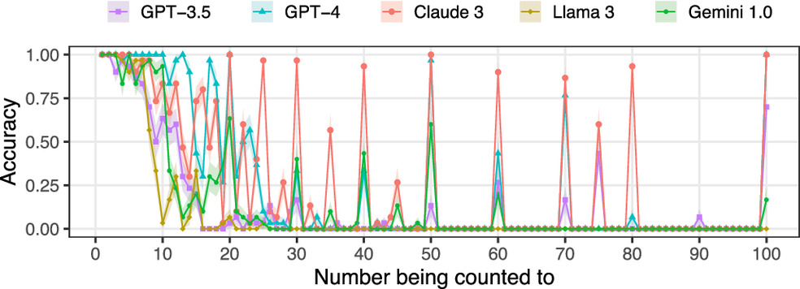
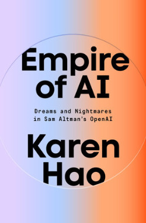

```{r, echo=FALSE, message=FALSE, warning=FALSE}
library(tidyverse)
library(ggdag)
library(dagitty)
```

## Outline for today

::: nonincremental
-   A brief history of artificial intelligence
-   Large language models & data-science applications
:::

# A history of AI

## 

   

Modern AI is built on **neural networks** — inspired by the brain, but increasingly diverging from it.

##  {background-color="#202A30"}


## Biological neurons

   

::: fragment
{fig-align="center" width="60%"}
:::

## Artificial neurons

   

McCulloch & Pitts (1943) proposed the first **artificial neuron** model

 

{fig-align="center" width="60%"}

::: fragment
-   A simple unit of computation inspired by the biological neuron
-   Takes *binary inputs*, computes a *weighted sum*, fires if it exceeds a threshold
-   Can be combined to implement *any Boolean logic*
-   *But:* weights are fixed — it cannot learn
:::

## Artificial neurons

 

Artificial neurons in modern network uses also continuous inputs and more sophisticated activation functions

{fig-align="center" width="80%"}

## Learning

:::::::: columns
::::: {.column width="60%"}
   

::: {style="font-size: 70%;"}
-   **Donald Hebb (1949)** *"Neurons that fire together, wire together"*
:::

<!-- Learning as strengthening of synaptic connections between co-active neurons -->

 

::: {style="font-size: 70%;"}
-   **Frank Rosenblatt (1962)** build the **Perceptron**: a single layer network that can learn weights from data
:::
:::::

:::: {.column width="40%"}
::: fragment
{fig-align="center" width="100%"}

{fig-align="center" width="50%"}
:::
::::
::::::::

## Limitations

<!-- {.smaller} -->

<!-- #### The XOR problem & Minsky–Papert (1969) -->

 

:::::::::::: columns
::::::: {.column width="40%"}
:::::: {style="font-size: 70%;"}
::: {.fragment fragment-index="1"}
*Perceptron Convergence Theorem* — if a *linear* solution exists, the perceptron is guaranteed to find it.
:::

 

::: {.fragment fragment-index="2"}
The bad news: many real problems are **not linearly separable** — the classic case is XOR:

| x₁  | x₂  | XOR |
|-----|-----|-----|
| 0   | 0   | 0   |
| 0   | 1   | 1   |
| 1   | 0   | 1   |
| 1   | 1   | 0   |

No single straight line can separate the 1s from the 0s.
:::

 

::: {.fragment fragment-index="3"}
[Minsky & Papert (1969) formalised these limitations — setting off the first **AI Winter**.]{style="color:#198754"}
:::
::::::
:::::::

:::: {.column width="30%"}
::: {.fragment fragment-index="2"}
```{r xor, fig.height=3.5, fig.width=3.5}
par(bg = "transparent", mar = c(3, 3, 2, 1))
plot(c(0,1,0,1), c(0,1,1,0),
     pch = c(1, 1, 16, 16), cex = 3.5,
     #col = c("#56B4E9","#E69F00","#E69F00","#56B4E9"),
     xlim = c(-0.4, 1.4), ylim = c(-0.4, 1.4),
     xlab = "x₁", ylab = "x₂",
     main = "XOR",
     #col.main = "white", 
     #col.lab = "white", 
     #col.axis = "white",
     bg = "transparent", axes = TRUE)
#grid(col = "#444444")
# legend("topright",
#        legend = c("correct output = 0", "correct output = 1"),
#        pch = c(1, 16),
#        #col = c("#56B4E9", "#E69F00"),
#        #text.col = "white", 
#        bg = "transparent", box.col = "transparent")
#axis(1, col.axis = "white", col = "white")
#axis(2, col.axis = "white", col = "white")
#box(col = "white")
```
:::
::::

:::: {.column width="30%"}
::: {.fragment fragment-index="3"}
{fig-align="center" width="100%"}
:::
::::
::::::::::::

## Single and multi-layer perceptrons

:::::: columns
::: {.column width="50%"}
{fig-align="center" width="80%"}
:::

:::: {.column width="50%"}
::: fragment
{fig-align="center" width="80%"}
:::
::::
::::::

## The first "AI winter" (1970-1980)

:::::: nonincremental
::: {.fragment fragment-index="1"}
-   Period of severely reduced funding and interest in neural network research, due to unmet expectations.
:::

::: {.fragment fragment-index="2"}
-   Funding and energy moved toward **symbolic AI**, focused on using high-level representations and logic to model human intelligence.
:::

::: {.fragment fragment-index="3"}
-   Minsky and Papert, among others, were proponents of symbolic AI approaches and argued that neural networks would fail to scale up beyond toy problems.
:::
::::::

 

::: {.fragment fragment-index="4"}
A second AI winter in the late 80s, when it became clear that many buyers and investors expected far more adaptability and robustness than what symbolic AI systems could provide.
:::

 

::: {.fragment fragment-index="5"}
[***Typical*** **AI winter pattern: not "no progress", but expectations rising much faster than capabilities.**]{style="color:#198754"}
:::

## Key milestones in neural network AI {.smaller .scrollable background-color="#202A30"}

```{r timeline, fig.height=6, fig.width=14, fig.align='center'}
# par(bg = "transparent", mar = c(4, 1, 2, 1))
# plot.new()
# plot.window(xlim = c(1940, 2022), ylim = c(-1.5, 4))
# 
# # Timeline axis
# lines(c(1943, 2018), c(1.5, 1.5), col = "white", lwd = 2)
# arrows(2018, 1.5, 2021, 1.5, length = 0.1, col = "white", lwd = 2)
# 
# events <- data.frame(
#   year  = c(1943, 1949, 1962, 1969, 1974, 1982, 1989, 1997, 2012, 2013, 2017),
#   label = c("MCP\nNeuron", "Hebb\nLearning", "Perceptron", "Minsky\n& Papert",
#             "1st AI\nWinter", "Backprop", "CNN", "LSTM",
#             "AlexNet", "Word2Vec", "Transformer"),
#   above = c(TRUE, FALSE, TRUE, FALSE, TRUE, FALSE, TRUE, FALSE, TRUE, FALSE, TRUE),
#   above_low = c(FALSE, FALSE, FALSE, FALSE, FALSE, FALSE, FALSE, FALSE, TRUE, FALSE, FALSE),
#   bio   = c(1, 1, 1, 1, 0, 1, 1, 1, 0.5, 0.5, 0),
#   stringsAsFactors = FALSE
# )
# 
# bio_cols <- colorRampPalette(c("#CC79A7","#E69F00","#56B4E9"))(3)
# 
# for (i in 1:nrow(events)) {
#   e <- events[i,]
#   col_i <- if (e$bio == 1) "#56B4E9" else if (e$bio == 0.5) "#E69F00" else "#CC79A7"
#   
#   points(e$year, 1.5, pch = 21, cex = 2.2, bg = col_i, col = "white", lwd = 1.5)
#   
#   if (e$above) {
#     
#     if (e$above_low){
#       y_offset <- -0.5
#     }else{
#       y_offset <- 0
#     }
#     
#     segments(e$year, 1.5, e$year, 2.8+y_offset, col = "#777777", lwd = 1)
#     text(e$year, 3.0+y_offset, e$label, col = "white", cex = 0.88, font = 2, adj = 0.5)
#     text(e$year, 1.1, e$year, col = "#aaaaaa", cex = 0.85)
#   } else {
#     segments(e$year, 1.5, e$year, 0.3, col = "#777777", lwd = 1)
#     text(e$year, 0.1, e$label, col = "white", cex = 0.88, font = 2, adj = 0.5)
#     text(e$year, 1.9, e$year, col = "#aaaaaa", cex = 0.85)
#   }
# }
# 
# # Legend
# legend(1943, -1, legend = c("Brain-inspired", "Hybrid", "Engineering-first"),
#        pch = 21, pt.bg = c("#56B4E9","#E69F00","#CC79A7"),
#        col = "white", text.col = "white", bg = "transparent",
#        box.col = "transparent", horiz = TRUE, pt.cex = 1.5, cex = 0.75)
# 
# title(" ", col.main = "white", cex.main = 1.1)


par(bg = "transparent", mar = c(4, 1, 2, 1))
plot.new()
plot.window(xlim = c(1940, 2022), ylim = c(-1.5, 4))

# --- AI Winter shading (draw before everything else so it sits behind) ---
rect(1970, -1.5, 1980, 4, col = "#4444aa33", border = NA)
text(1975, 3.7, "1st AI Winter", col = "#aaaaff", cex = 0.75, font = 3, adj = 0.5)

# Timeline axis
lines(c(1943, 2018), c(1.5, 1.5), col = "white", lwd = 2)
arrows(2018, 1.5, 2021, 1.5, length = 0.1, col = "white", lwd = 2)

events <- data.frame(
  year  = c(1943, 1949, 1962, 1969, 1982, 1989, 1997, 2012, 2013, 2017),
  label = c("MCP\nNeuron", "Hebb\nLearning", "Perceptron", "Minsky\n& Papert",
            "Backprop", "CNN", "LSTM",
            "AlexNet", "Word2Vec", "Transformer"),
  above = c(TRUE, FALSE, TRUE, FALSE, FALSE, TRUE, FALSE, TRUE, FALSE, TRUE),
  above_low = c(FALSE, FALSE, FALSE, FALSE, FALSE, FALSE, FALSE, TRUE, FALSE, FALSE),
  bio   = c(1, 1, 1, 1, 1, 1, 1, 0.5, 0.5, 0),
  stringsAsFactors = FALSE
)

for (i in 1:nrow(events)) {
  e <- events[i,]
  col_i <- if (e$bio == 1) "#56B4E9" else if (e$bio == 0.5) "#E69F00" else "#CC79A7"

  points(e$year, 1.5, pch = 21, cex = 2.2, bg = col_i, col = "white", lwd = 1.5)

  if (e$above) {
    y_offset <- if (e$above_low) -0.5 else 0
    segments(e$year, 1.5, e$year, 2.8 + y_offset, col = "#777777", lwd = 1)
    text(e$year, 3.0 + y_offset, e$label, col = "white", cex = 0.88, font = 2, adj = 0.5)
    text(e$year, 1.1, e$year, col = "#aaaaaa", cex = 0.85)
  } else {
    segments(e$year, 1.5, e$year, 0.3, col = "#777777", lwd = 1)
    text(e$year, 0.1, e$label, col = "white", cex = 0.88, font = 2, adj = 0.5)
    text(e$year, 1.9, e$year, col = "#aaaaaa", cex = 0.85)
  }
}

# Legend
legend(1943, -1, legend = c("Brain-inspired", "Hybrid", "Engineering-first"),
       pch = 21, pt.bg = c("#56B4E9","#E69F00","#CC79A7"),
       col = "white", text.col = "white", bg = "transparent",
       box.col = "transparent", horiz = TRUE, pt.cex = 1.5, cex = 0.75)
title(" ", col.main = "white", cex.main = 1.1)

```

-   1982: **Backpropagation algorithm**: scalable training of multilayer perceptrons revives interest in neural networks

-   1989 **Convolutional neural network (CNN)**: spatial convolutions inspired by the hierarchical organisation of the visual system

-   1997 **Long short-term memory (LSTM)**: recurrent network that can learn long-range dependencies in sequences, inspired by recurrence in brain circuits

-   2012 **Deep learning**: AlexNet wins the ImageNet competition by a large margin, sparking major industry interest

-   2013 **word2vec** dense distributed word embeddings learned from huge text corpora, allowing to represent semantics with list of numbers (not unlike the brain)

-   2017 *"Attention is all you need"* paper introduces the **transformer** architecture, which underlies modern large language models (GPT, Claude, Gemini, etc.)

## AlexNet & the ImageNet competition

 

::::: columns
::: {.column width="70%"}
{fig-align="center" width="100%"}
:::

::: {.column width="30%"}
{fig-align="center" width="100%"}
:::
:::::

 

::: fragment
The success of AlexNet was due also to recent developments in availability of large scale labelled datasets and general purpose GPU computing.
:::

## How brain-like are neural networks? {.scrollable}

 

Many influential ideas in neural networks were borrowed from biology:

::: {style="font-size: 70%;"}
-   The artificial neuron as a basic computational unit in a network

-   Early learning algorithms (e.g. the perceptron) were inspired by the strengthening of connections between co-active neurons (Hebb rule)

-   Information is stored in the strength of synaptic connections, a central idea in neuroscience

-   Convolutional networks were heavily inspired by biological vision (local receptive fields, hierarchical feature detectors)

-   Early approaches to language and sequence learning relied on *recurrence*, echoing recurrent connectivity in the brain

-   Semantic concepts can be represented in a distributed way: both artificial and biological networks encode information as patterns of activity across many units
:::

   

::: fragment
[Over time, neural networks increasingly diverged from biology, replacing biological realism with engineering abstractions.]{style="color:#198754"}
:::

   

::: fragment
A first example is [backpropagation]{.underline}: it uses the chain rule to propagate errors backward and update connection weights during learning. By contrast, biological neurons are thought to learn mainly from locally available signals, and no clear biological equivalent of backpropagation is known.
:::

   

::: fragment
The clearest example is the [transformer architecture]{.underline}: achieved a big boost in performance obtained *precisely by abandoning some of the most brain-inspired ideas* (recurrence and convolution).
:::

## Transformer architecture

:::::: columns
:::: {.column width="50%"}
::: {style="font-size: 80%;"}
From a neuroscience perspective, several aspects are strikingly un-brain-like, and hard to justify except by their empirical success:

-   [Parallel processing of all [*tokens*](https://platform.openai.com/tokenizer)]{.underline} ($\approx$ words) in a single feedforward pass, rather than sequentially
-   [Global pairwise token interactions]{.underline}: every token can interact directly with every other token
-   [Multi-head attention]{.underline}: multiple parallel attention mechanisms operate at once
-   [Positional encoding]{.underline}: sequence order must be added explicitly because the architecture has no built-in notion of order
:::
::::

::: {.column width="50%"}
{fig-align="center" width="80%"}
:::
::::::

## 

#### Positional encoding in transformers

:::::::: columns
:::::: {.column width="50%"}
:::: {style="font-size: 70%;"}
::: nonincremental
-   Tokens are first represented using a *one-hot* code.

-   They are then mapped onto lower-dimensional dense embeddings, vectors[^1] of numbers that capture aspects of word meaning, so that related words lie close together in the embedding space.
:::

-   Because transformers process all tokens simultaneously, they have no built-in sense of sequence. To encode word order, a position vector is added to each embedding.

-   [This is a strikingly un-brain-like solution: rather than sequence emerging from dynamics or recurrence, order is imposed by adding an explicit numerical code for position.]{style="color:#198754"}
::::

::: fragment
```{r post}
#| fig-height: 2
#| fig-width: 3
#| fig-align: 'center'
#| fig-cap: "Positional encoding matrix for a text of 50 words, and an internal embedding dimensions of 100."


# ---------------------------------------------
# transformer positional encoding
n <- 20
d <- 50
PE <- matrix(nrow=n, ncol=d)

for(ir in 1:n){
  
  i_sin <- seq(2,d,2)
  i_cos <- seq(0,d-1,2)+1
  
  PE[ir, i_sin] <- sin(ir/(10000^(i_sin/d)))
  PE[ir, i_cos] <- cos(ir/(10000^(i_cos/d)))
}

library(tidyverse)
library(reshape2)

PE <- PE[seq(n,1,-1),]
longData<-melt(PE)

ggplot(longData, aes(x = Var2, y = Var1)) + 
  geom_raster(aes(fill=value)) + 
  scale_fill_gradient(low="grey90", high="red", guide="none") +
  labs(x="dimension", y="word", title=" ") +
  theme_bw() + theme(axis.text.x=element_text(size=9, angle=0, vjust=0.3),
                     axis.text.y=element_text(size=9),
                     plot.title=element_text(size=11))

```
:::
::::::

::: {.column width="50%"}
{fig-align="center" width="80%"}
:::
::::::::

[^1]: A vector is simply an ordered list of numbers. An $n$-dimensional vector defines a position in an $n$-dimensional space.

## 

Visual explainer: <https://poloclub.github.io/transformer-explainer/>

```{=html}
<iframe width="1050" height="600" src="https://poloclub.github.io/transformer-explainer/"></iframe>
```

## How do transformers learn?

Like earlier neural networks, transformers learn by adjusting millions or billions of parameters through **backpropagation**.

-   During training, the model is shown huge amounts of text and asked to predict the next token
-   When its prediction is wrong, the error is computed and propagated backward through the network
-   This gradually adjusts the weights so that future predictions improve

 

::: fragment
Although first developed for sequence-to-sequence tasks such as translation, this training objective turned out to support other abilities too.
:::

## After 2017

-   **Transformers rapidly scaled up**: more data, more compute, and many more parameters
-   **Multimodal models** extended the same general approach beyond text, combining language with images, audio, and other inputs
-   **ChatGPT** made this technology widely visible when it was released to the public in November 2022

<!-- ## Ethics of modern AI -->

<!-- - My view: nothing inherently wrong with the technology, but the investment bubble likely to have negative effects for environment, wealth inequality, etc. -->

<!-- - AI misalignment: models have 'no wants', but if not regulated can definitely have unintended, negative consequences -->

<!-- - Even worse when given agentic capabilities (e.g. OpenClaw) -->

## Limits of large language models

 

::: {layout="[[1,1]]"}

](img/embers.png){fig-align="center" width="70%"}




:::

<!-- _"Stochastic parrots" shaped by the problem they are trained to solve_ -->

## Ethics of AI

::: {layout="[[1,1, 1]]"}


](img/FTwomen.png)


](img/shamblog_AImisalign.png)


:::

:::: {style="font-size: 70%;"}

Critical AI literacy resources by Olivia Guest: [https://olivia.science/ai/](https://olivia.science/ai/)

::::


# Practical session: calling language models from R

## 

Today we will use the [**ellmer**](https://ellmer.tidyverse.org/) package in R to call large language models from code.

-   `ellmer` provides a simple interface to a wide range of model providers
-   It lets us send prompts, receive model outputs and process them directly in R

##  {.scrollable background-color="#202A30"}

#### Steps to create a Gemini API key and adding it to R environment

1.  Go to: <https://ai.google.dev/aistudio>

2.  Click **GET API KEY** in the top bar.

3.  Sign in with a Google account, or create one if needed.

4.  After logging in, you should be taken to: <https://aistudio.google.com/api-keys>

5.  Click **Create API key**. \newline After entering a name, a new API key will appear in the list on that page. Click the 'copy' key icon, then return to RStudio.

6.  In RStudio, run the following command in the console: `usethis::edit_r_environ()` This will open your .Renviron file in the editor. Add a line that starts like this: `GEMINI_API_KEY=<paste API key here>` making sure to paste the API key you created above after the equal sign. Then save and close the file.

7.  Restart R (you can do this by pressing Ctrl + Shift + F10, or by clicking Session \> Restart R).

8.  Testing that it works After completing these steps, you can test whether everything is working by running:

::: fragment
```{r, eval=FALSE, echo=TRUE}
library(ellmer)

# start a chat
chat <- chat_google_gemini()

# test a prompt
chat$chat("Explain why overfitting in machine learning is a problem.")

```
:::

##  {.scrollable}

```{r, echo=TRUE}
library(ellmer)

# chat <- chat_google_gemini("You are a terse assistant.")
chat <- chat_openai("You are a terse assistant.") 

chat$chat("What is the capital of Italy?")

# the client is stateful, so this continues the conversation
chat$chat("What is its most famous landmark?")

```

   

::: fragment
```{r, echo=TRUE}
chat

```
:::

## Anatomy of a conversation

-   Each interaction is a pair of user and assistant turns, corresponding to a HTTP request and response.

-   Messages are in JSON (JavaScript Object Notation) format

-   The API server is *stateless* (does not store anything about the conversation), even though conversation are *statefull*.

<!-- ```{r} -->

<!-- httr2::with_verbosity(chat$chat("What is its most famous landmark?"), verbosity=2) -->

<!-- httr2::local_verbosity(2, env = caller_env()) -->

<!-- ``` -->

##  {.scrollable}

We can see what is going on under the hood using `options(httr2_verbosity = 2)`

   

User request

```         
 {
   "contents": [
     {
       "role": "user",
       "parts": [
         {
           "text": "What is the capital of Italy?"
         }
       ]
     }
   ],
   "systemInstruction": {
     "parts": {
       "text": "You are a terse assistant."
     }
   }
}
```

##  {.scrollable}

API server response

```         
type: message
data: {
  "candidates": [
    {
      "content": {
        "parts": [
          {
            "text": "Rome"
          }
        ],
        "role": "model"
      },
      "finishReason": "STOP",
      "index": 0
    }
  ],
  "usageMetadata": {
    "promptTokenCount": 14,
    "candidatesTokenCount": 1,
    "totalTokenCount": 35,
    "promptTokensDetails": [
      {
        "modality": "TEXT",
        "tokenCount": 14
      }
    ],
    "thoughtsTokenCount": 20
  },
  "modelVersion": "gemini-2.5-flash",
  "responseId": "X0rEaeDNCpCuxN8P0YmZiAE"
}
```

## Working with 'unstructured' data {.scrollable}


```{r, echo=TRUE}
recipe <- "
  In a large bowl, cream together 1 cup of softened unsalted butter and ½ cup
  of white sugar until smooth. Beat in 1 egg and 1 teaspoon of vanilla extract.
  Gradually stir in 2 cups of all-purpose flour until the dough forms. Finally,
  fold in 1 cup of semisweet chocolate chips. Drop spoonfuls of dough onto an
  ungreased baking sheet and bake at 350°F (175°C) for 10-12 minutes, or until
  the edges are lightly browned. Let the cookies cool on the baking sheet for
  a few minutes before transferring to a wire rack to cool completely. Enjoy!
"

chat <- chat_openai("
  The user input contains a recipe. Extract a list of ingredients and
  return it in table format."
)
chat$chat(recipe)
```


## 

Another example of unstructured data

```{r}
# Load the dataset
intro_msgs <- read_csv("ellmer_forum_intro_dataset.csv", show_col_types = FALSE)

print(intro_msgs)
```

_Can you write code to extract name and age information from the introduction messages?_


## {.scrollable}

```{r, echo=TRUE}
library(jsonlite)

chat <- chat_openai(
  system_prompt = paste(
    "You extract structured information from short self-introduction messages.",
    "Return ONLY valid JSON with exactly these keys:",
    '{"name":"...","age":0}'
  )
)

results <- vector("list", nrow(intro_msgs))

for (i in 1:nrow(intro_msgs)) {

  prompt <- paste(
    "Extract the person's name and age from this forum introduction.",
    "Return JSON only.",
    "",
    intro_msgs$message[i]
  )

  raw <- chat$chat(prompt,echo = "none")
  parsed <- fromJSON(raw)

  results[[i]] <- tibble(
    message_id = intro_msgs$message_id[i],
    message = intro_msgs$message[i],
    name = parsed$name,
    age = parsed$age
  )
}

extracted <- bind_rows(results)

print(extracted)
```

# Where to go from here

## What have you learned?

-   **R Programming Fundamentals**\
    Data types, data structures, control flow, and custom functions\
-   **Data Importing & Cleaning**\
    Using `tidyverse` packages (`readr`, `dplyr`, `tidyr`)\
-   **Data Visualization**\
    Base R plotting and ggplot2 basics\
-   **Machine Learning Foundations**\
    Supervised (regression, classification) and unsupervised (clustering, GMMs)\
-   **Reproducible Reporting**\
    R Markdown for transparent, documented analysis

------------------------------------------------------------------------

## Where to go next?

## Where to go next?

:::: {.fragment fragment-index="1"}
**Further study:**

::: nonincremental
-   [***R for Data Science***](https://r4ds.had.co.nz/) by Hadley Wickham (practical, applied DS)\
-   [***Statistical Rethinking***](https://xcelab.net/rm/) by Richard McElreath (Bayesian/statistical modeling, great for academic paths)
:::
::::

:::: {.fragment fragment-index="2"}
::: nonincremental
-   [***Statistics for Psychology using R: a linear models perspective***](https://www.mheducation.co.uk/statistics-for-psychology-using-r-a-linear-models-perspective-9780335252626-emea-group)\
    by Alasdair Clarke & myself.
:::
::::

:::::::::: columns
::::::: {.column width="70%"}
:::: {.fragment fragment-index="3"}
::: nonincremental
-   **Practice, Practice, Practice**
    -   Explore Kaggle datasets or other open data portals\
    -   Join hackathons or coding challenges\
:::
::::

:::: {.fragment fragment-index="4"}
::: nonincremental
-   **Self-directed Projects**
    -   Pick a dataset in your area of interest (e.g. OSF)\
    -   Try cleaning, analyzing, and visualizing it from scratch\
:::
::::
:::::::

:::: {.column width="30%"}
::: {.fragment fragment-index="2"}
{fig-align="center" width="75%"}
:::
::::
::::::::::

------------------------------------------------------------------------

## Get out there & connect!

-   **Data Volunteer Opportunities**
    -   [DataKind UK](https://www.datakind.org.uk/resources/data-volunteering-development)
        -   Projects supporting nonprofits, social causes\
        -   Great place to learn while contributing\
-   **Networking & Communities**
    -   [R-Ladies](https://www.meetup.com/pro/rladies/): Inclusive community for R users\
    -   [Black in Data](https://www.blackindata.co.uk/): UK-based collective for representation in data fields\
    -   [Women in Data](https://womenindata.co.uk/): Community events, mentorship, and resources


