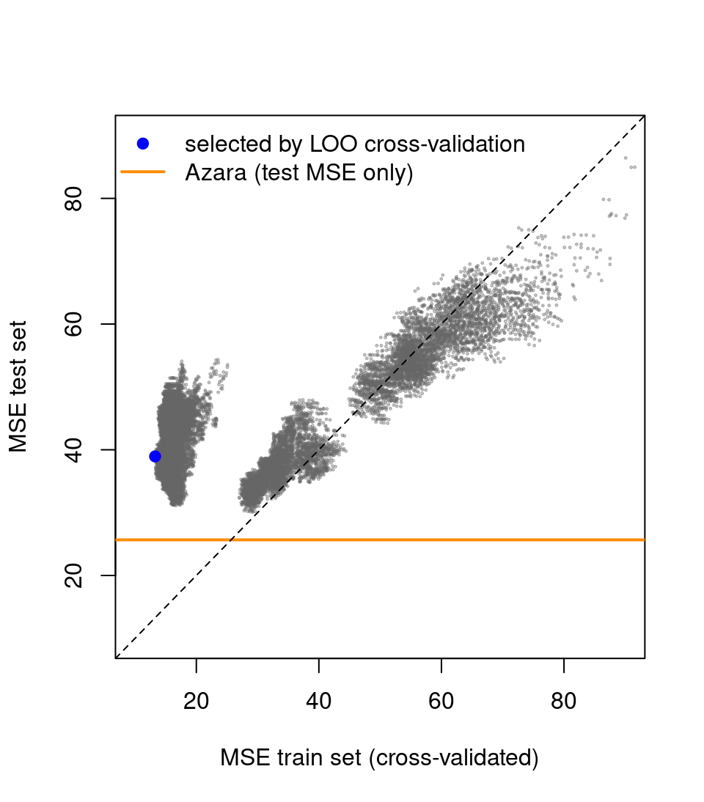
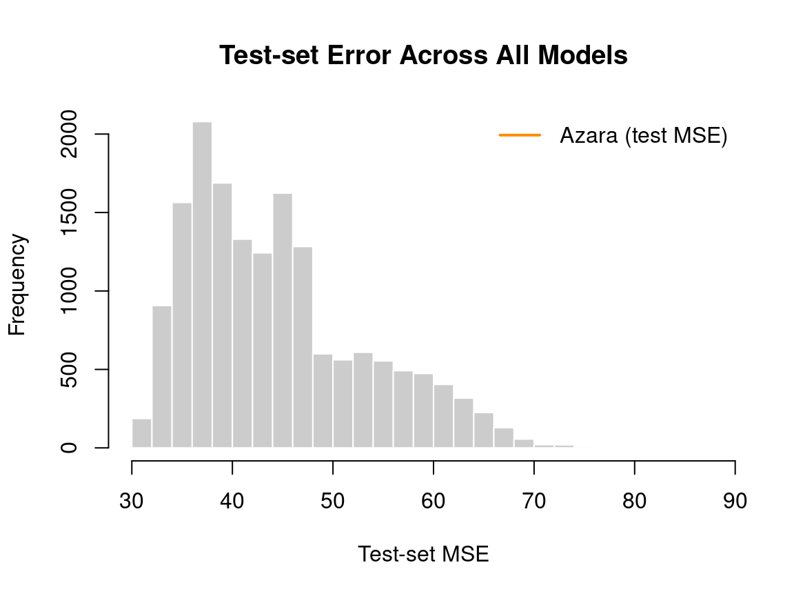

::: {.cell}

:::


# California Housing Exercise

## 

### Goal

- Fit many candidate models automatically.
- Use cross-validation to estimate generalization.
- Check performance on a truly unseen test set.

## Load the Training Data


::: {.cell}
::: {.cell-output .cell-output-stdout}

```
'data.frame':	100 obs. of  15 variables:
 $ lon    : num  -71.1 -71.1 -71 -71.1 -71.1 ...
 $ lat    : num  42.2 42.2 42.2 42.2 42.2 ...
 $ medv   : num  22.5 46.7 11.3 25 33.2 36 17.5 22.5 21.8 36.1 ...
 $ crim   : num  0.252 0.298 9.187 0.198 0.105 ...
 $ zn     : num  0 0 0 0 40 20 0 0 0 33 ...
 $ indus  : num  10.59 6.2 18.1 10.59 6.41 ...
 $ chas   : int  0 0 0 0 1 0 0 0 0 0 ...
 $ nox    : num  0.489 0.504 0.7 0.489 0.447 0.647 0.442 0.449 0.532 0.472 ...
 $ rm     : num  5.78 7.69 5.54 6.18 7.27 ...
 $ age    : num  72.7 17 100 42.4 49 100 48.5 45.1 40.3 41.1 ...
 $ dis    : num  4.35 3.38 1.58 3.95 4.79 ...
 $ rad    : int  4 8 24 4 4 5 3 3 24 7 ...
 $ tax    : int  277 307 666 277 254 264 352 247 666 222 ...
 $ ptratio: num  18.6 17.4 20.2 18.6 17.6 13 18.8 18.5 20.2 18.4 ...
 $ lstat  : num  18.06 3.92 23.6 9.47 6.05 ...
```


:::
:::


## Generate All Model Formulas


::: {.cell}

:::


## How Many Models?


::: {.cell}
::: {.cell-output .cell-output-stdout}

```
[1] 16383
```


:::
:::


Example formulas:


::: {.cell}
::: {.cell-output .cell-output-stdout}

```
[[1]]
[1] "medv ~ lon + zn + indus + chas + nox + rm + tax"

[[2]]
[1] "medv ~ lat + crim + zn + indus + ptratio"

[[3]]
[1] "medv ~ lon + lat + zn + indus + rm + tax + ptratio"

[[4]]
[1] "medv ~ lat + zn + nox + rm + age"

[[5]]
[1] "medv ~ lon + lat + crim + zn + indus + chas + nox + rm + age + dis + rad"
```


:::
:::


## Custom Function: LOO Cross-Validation


::: {.cell}

:::


## Test All Models (Control Flow)


::: {.cell}

:::


## Load Precomputed Results


::: {.cell}
::: {.cell-output .cell-output-stdout}

```
          MSE    r_squared      formula test_MSE test_rsquared
MSE  87.76874 -0.001004347   medv ~ lon 77.57901    0.06462806
MSE1 90.06561 -0.027200198   medv ~ lat 86.43157   -0.04210746
MSE2 79.97468  0.087887053  medv ~ crim 73.81616    0.10999675
MSE3 81.65028  0.068776832    medv ~ zn 74.26506    0.10458443
MSE4 62.46558  0.287578712 medv ~ indus 67.54650    0.18559028
MSE5 90.96837 -0.037496226  medv ~ chas 84.93431   -0.02405500
```


:::
:::


## Find the Best Model (by LOO MSE)


::: {.cell}
::: {.cell-output .cell-output-stdout}

```
[1] "medv ~ lon + lat + crim + rm + age + dis + tax + lstat"
```


:::

::: {.cell-output .cell-output-stdout}

```
[1] 13.27313
```


:::

::: {.cell-output .cell-output-stdout}

```
[1] 0.8486196
```


:::
:::


## Evaluate on the True Test Set


::: {.cell}
::: {.cell-output .cell-output-stdout}

```
[1] 38.94542
```


:::

::: {.cell-output .cell-output-stdout}

```
[1] 0.5304341
```


:::
:::


## Train vs Test Error (All Models)


::: {.cell layout-align="center"}
::: {.cell-output-display}
{fig-align='center' width=480}
:::
:::


## Add the Optional Student Submission (Azara)


::: {.cell layout-align="center"}
::: {.cell-output-display}
{fig-align='center' width=480}
:::
:::


## Histogram of Test-Set Error (All Models)


::: {.cell layout-align="center"}
::: {.cell-output-display}
{fig-align='center' width=576}
:::
:::


## Take-Home

- Cross-validation is helpful, but can be optimistic if used for model selection.
- The true test set gives a more honest estimate of generalization.
- Even simple models can be competitive with a good feature choice.
