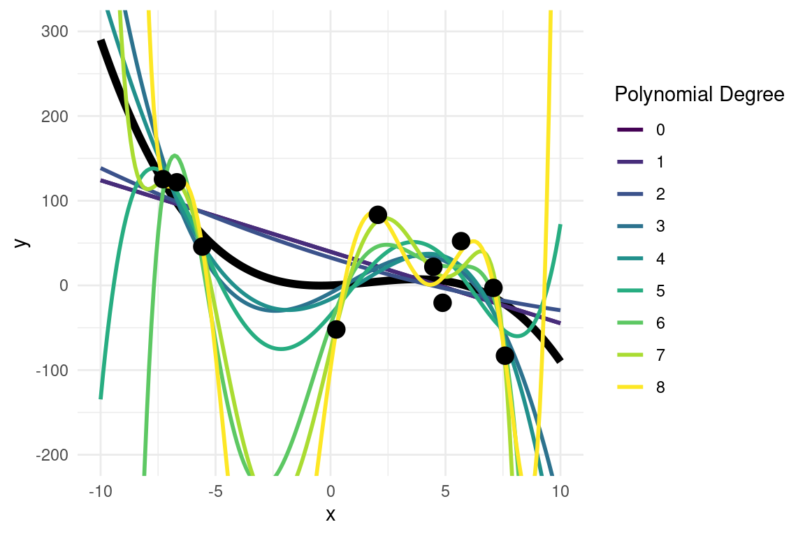
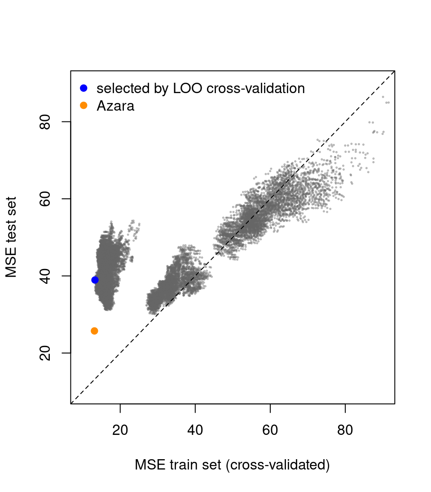
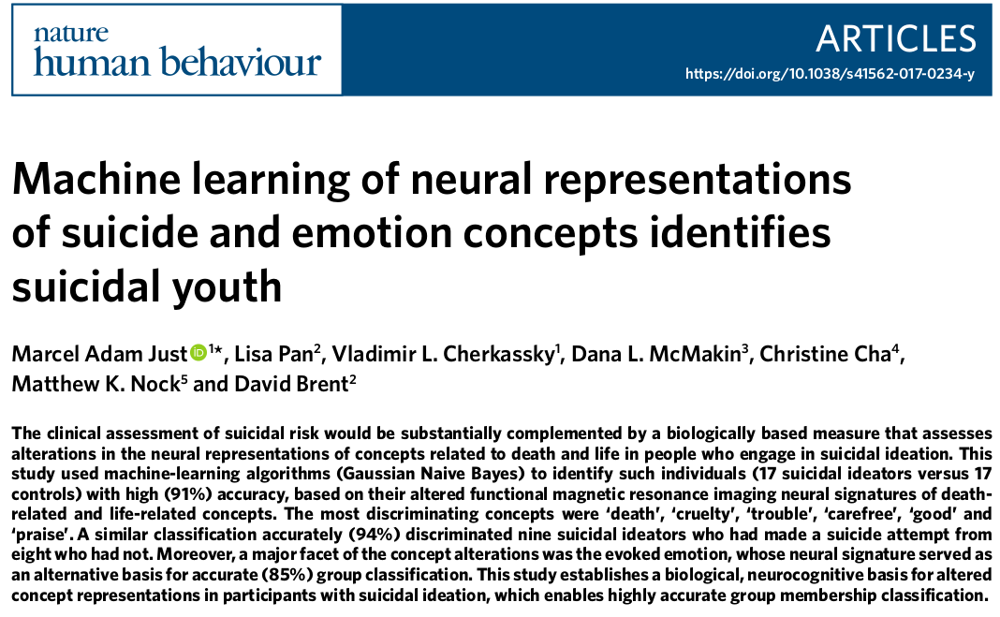

::: {.cell}

:::


# Introduction to Machine Learning

##  {transition="slide-in slide-out"}

#### "Data science"

::: nonincremental
-   Data wrangling (data cleaning & preparation)
-   Data visualization
-   Statistics & probability
-   **Machine learning & predictive modelling**
-   Causal inference
-   Big data & data engineering
-   Applied context (actionable insights)
-   Communication
:::

<!-- ## Learning Outcomes for today -->

<!-- -   Grasp **fundamental machine learning** concepts -->

<!-- -   Recognize typical pitfalls -->

<!-- -   Build and evaluate models in R -->

## Machine learning

::: {.fragment .fade-up}
> *"as a set of methods that can automatically detect patterns in data, and then use the uncovered patterns to predict future data, or to perform other kinds of decision making under uncertainty"* (Murphy, 2012)
:::

 

-   Machine learning (ML) is grounded in the same principles as statistical science.
-   ML differs from statistics in that it has a "technological" rather that scientific focus: the goal in ML is to solve a problem, e.g. predict which product a customer might buy, rather than understanding the world.
-   Close to artificial intelligence (AI) which is even more focused on creating machines that can carry out tasks that would normally require human involvement.

## Types of machine learning

-   **Supervised learning** predict the next value based on a set of examples (regression, classification).
-   **Unsupervised learning** more descriptive and data driven (clustering).
-   **Reinforcement learning** learn how to act from reward and punishment signals.

## Supervised vs. Unsupervised Learning

 

::: fragment
**Supervised Learning**\
- We have a *training* dataset containing some with input features $X$ and target labels/outcomes $y$\
- The algorithm learns a function $f(X)$ that predicts $y$ accurately\
- Learning is achieved by minimising a *cost* or *loss* function (i.e. an error metric that tells us how bad the predictions are compared to the observed $y$)\
- Examples: **Regression** (continuous outcomes), **Classification** (categorical outcomes)
:::

 

::: fragment
**Unsupervised Learning**\
- We only have input features $X$, with no labeled outcome\
- The algorithm finds structure in the data (e.g., clusters, latent factors)\
- Much less well-defined problem since we don't know usually know in advance what to look for.\
- Examples: **Clustering** (e.g., gaussian mixture models), **Dimensionality Reduction** (PCA)
:::

## Linear regression as a supervised ML algorithm

::: fragment
Model: $$\hat y = \beta_0 + \beta_1 X_1 + \ldots + \beta_k X_k$$
:::

::: fragment
Residuals errors: $$\epsilon_i = y_i - \hat y_i$$
:::

::: fragment
The *loss* function is the **mean squared error**: $$\text{MSE} = \frac{1}{n}\sum_{i=1}^n \epsilon_i^2 $$
:::


## Logistic regression as a supervised ML algorithm {.scrollable}

::: fragment
Model (predicting a probability):
$$
\hat p_i = P(y_i = 1 \mid \mathbf X_i)
= \sigma(\beta_0 + \beta_1 X_{i1} + \ldots + \beta_k X_{ik})
$$

where
$$
\sigma(z) = \frac{1}{1 + e^{-z}}
$$
:::

::: fragment
Observed outcome:
$$
y_i \in \{0,1\}
$$

We compare the predicted probability $\hat p_i$ to the true class $y_i$.
:::

 

::: fragment
Loss function (**cross-entropy / log loss**):
$$
\mathcal L_i
= - \Big[ y_i \log(\hat p_i)
+ (1 - y_i)\log(1 - \hat p_i) \Big]
$$
:::

::: fragment
Average loss over the dataset:
$$
\text{Cross-entropy}
= \frac{1}{n}\sum_{i=1}^n \mathcal L_i
$$

The model is trained by choosing coefficients $\beta$ that minimise this loss.
:::


##

#### Cross-entropy / log loss

 


::: {.cell layout-align="center"}
::: {.cell-output-display}
{fig-align='center' width=672}
:::
:::


# Machine-learning concepts

## 

### Parametric vs non-parametric models

-   **Parametric** models are those which can describe/predict the data with a fixed number of parameters.

-   **Non-parametric** models tend to now have a fixed number of parameters, and tend to make milder assumptions

-   *There isn't a precise and universally accepted definition of the term 'nonparametric'.*

## 

#### Non-parametric supervised learning: decision trees


::: {.cell layout-align="center"}
::: {.cell-output-display}
{fig-align='center' width=960}
:::
:::


## 

<!-- ### Curse of dimensionality -->

<!--   -->

<!-- ::: {.fragment fragment-index="1"} -->
<!-- ML learning problems tend to be high-dimensional (e.g. datasets can easily have thousands or more feature $X$ that we can use for learning and prediction). -->
<!-- ::: -->

<!-- ::::::: columns -->
<!-- :::: {.column width="50%"} -->
<!-- ::: {.fragment fragment-index="2"} -->
<!--   -->

<!-- The amount of data that we need to learn effectively grows exponentially with the number of features -->
<!-- ::: -->
<!-- :::: -->

<!-- :::: {.column width="50%"} -->
<!-- ::: {.fragment fragment-index="2"} -->
<!-- ```{r} -->
<!-- #| fig-height: 3 -->
<!-- #| fig-width: 3  # Half the slider width when default slide width is 4 -->
<!-- #| fig-align: center -->
<!-- #| echo: FALSE -->

<!-- library(tidyverse) -->

<!-- x <- seq(10, 20, length.out=100) -->
<!-- y <- exp(x) -->

<!-- data.frame(x,y) %>% -->
<!--   ggplot(aes(x=x, y=y))+ -->
<!--   geom_line(lwd=2,col="red")+theme_void()+ -->
<!--   theme(axis.title.x = element_text(), -->
<!--         axis.title.y = element_text(angle=90))+ -->
<!--   labs(x="n. features",y="amount of data") -->

<!-- ``` -->
<!-- ::: -->
<!-- :::: -->
<!-- ::::::: -->

## Overfitting

-   Main goal of supervised ML is to make predictions on novel inputs not seen before (**generalization**)

-   When we fit highly complex/flexible model we need to be careful to not **overfit** the data, as this would lead to worse performance on unseen (new) data

## Overfitting example

::::: columns
::: {.column width="60%"}


::: {.cell}

```{.r .cell-code}
# assume a "true" underlying function
x <- seq(-10, 10, length.out = 200)
y <- x + x^2 -0.2*x^3

# simulate some noisy observations
x_obs <- x[sample(1:200, 10)]
y_obs <- x_obs + x_obs^2  -0.2*x_obs^3 +rnorm(10, mean=0, sd=50)

# store in a dataframe
d <- data.frame(y=y_obs,
                x=x_obs)

# plot
plot(x,y, type="l", col="blue", lwd=2, ylim=c(-200, 300))
points(x_obs, y_obs, pch=19)
```
:::


:::

::: {.column width="40%"}


::: {.cell layout-align="center"}
::: {.cell-output-display}
{fig-align='center' width=384}
:::
:::


:::
:::::

::: fragment
Known "true" model: $$y = x + x^2 -0.2x^3$$
:::

## Overfitting example

We can fit polynomial functions of increasing order using `lm()`


::: {.cell}

```{.r .cell-code}
m <- list()
m[[1]] <- lm(y~1, d)
m[[2]] <- lm(y~x, d)
m[[3]] <- lm(y~x +I(x^2), d)
m[[4]] <- lm(y~x +I(x^2) +I(x^3), d)
m[[5]] <- lm(y~x +I(x^2) +I(x^3) +I(x^4), d)
m[[6]] <- lm(y~x +I(x^2) +I(x^3) +I(x^4) +I(x^5), d)
```
:::


## Overfitting example

We can fit polynomial functions of increasing order using `lm()`

 

We can use a `for` loop to programmatically fit models of increasing complexity


::: {.cell}

```{.r .cell-code}
m <- list() # an empty list

# intercept-only model in the 1st slot
m[[1]] <- lm(y~1, d)

# fit models of increasing complexity
for (p in 0:8) {
  formula <- as.formula(paste("y ~", paste0("I(x^", 1:p, ")", collapse="+")))
  m[[p + 1]] <- lm(formula, data = d)
}
```
:::


## Overfitting example

For each model, let's compute the error in the training set


::: {.cell}

```{.r .cell-code}
# error on training set
training_error <- rep(NA, length(m))

for(i in 1:length(m)){
  
  # extract predicted values
  pred_y <- predict(m[[i]]) 
  
  # mean squared error
  training_error[i] <- mean((d$y -  pred_y)^2)
}
```
:::


## Overfitting example

We know the "true" generative model and we can use to generate new data unseen by our models


::: {.cell}

```{.r .cell-code}
# generate unseen data
x_new <- runif(100, min=-10, max=10)
y_new <- x_new + x_new^2  -0.2*x_new^3 + rnorm(100, mean=0, sd=50)
d_new <- data.frame(x = x_new, y=y_new)

test_error <- rep(NA, length(m))
for(i in 1:length(m)){
  pred_y <- predict(m[[i]], newdata=d_new)
  test_error[i] <-  mean((d_new$y -  pred_y)^2)
}
```
:::


## Overfitting example


::: {.cell layout-align="center"}

```{.r .cell-code}
plot(1:length(m), training_error,
     xlab="n. parameters", ylab="MSE",
     ylim=c(0,9000), type="o", col="blue")

lines(1:length(m), test_error, type="o", col="red")
```

::: {.cell-output-display}
{fig-align='center' width=576}
:::
:::


## Overfitting example

The higher order polynomials are clearly too complex and overfit the data


::: {.cell layout-align="center"}
::: {.cell-output-display}
{fig-align='center' width=576}
:::
:::


## Approached to mitigage overfitting: cross-Validation

-   Split data into $k$ folds (subsets)\
-   Train on $k - 1$ folds, test on the remaining, hold-out fold\
-   Repeat for each fold; average performance across folds for a robust metric.
-   When we leave out only 1 observation is known as leave-one-out (LOO) cross-validation

 

::: fragment
The key idea is that we put aside some data when training the model, and then use it for evaluate its performance
:::

## 

**Example code 1**: evaluating a linear model on a hold-out set


::: {.cell}

```{.r .cell-code}
# Suppose 'mydata' has columns: y, X1, X2
mydata <- read.csv("mydata.csv")

set.seed(123)  # for reproducibility
train_index <- sample(seq_len(nrow(mydata)), size = 0.7*nrow(mydata))
train_data <- mydata[train_index, ]
test_data  <- mydata[-train_index, ]

# Fit model
model <- lm(y ~ X1 + X2, data = train_data)

# Predict on test data
preds <- predict(model, newdata = test_data)

# Calculate Mean Squared Error
mse <- mean((test_data$y - preds)^2)
```
:::


## 

**Example code 2**: LOO cross-validation


::: {.cell}

```{.r .cell-code}
# Suppose 'mydata' has columns: y, X1, X2
mydata <- read.csv("mydata.csv")

n <- nrow(mydata)  # Total number of observations
preds <- numeric(n)  # Placeholder for predictions

# Leave-One-Out Cross-Validation

for (i in 1:n) {
  # Define training and test sets
  train_data <- mydata[-i, ]  # All except the i-th observation
  test_data  <- mydata[i,  ]  # The i-th observation
  
  # Fit the model
  model <- lm(y ~ X1 + X2, data = train_data)
  
  # Predict for the left-out observation
  preds[i] <- predict(model, newdata = test_data)
}

# Compute overall Mean Squared Error
mse_loo <- mean((mydata$y - preds)^2)
```
:::


## Last week: California Housing Dataset

(See week 1 worksheet)

::: {style="font-size: 60%;"}
| Variable | Description |
|-----------------------------------|-------------------------------------|
| **medv** | **Median value of owner-occupied homes (in \$1000s)** |
| crim | Per capita crime rate by town |
| zn | Proportion of residential land zoned for large lots |
| indus | Proportion of non-retail business acres per town |
| chas | Charles River dummy variable (1 if tract bounds river, 0 otherwise) |
| nox | Nitrogen oxide concentration (parts per 10 million) |
| rm | Average number of rooms per dwelling |
| age | Proportion of owner-occupied units built before 1940 |
| dis | Weighted distance to employment centers |
| rad | Index of accessibility to highways |
| tax | Property tax rate per \$10,000 |
| ptratio | Pupil-teacher ratio by town |
| lstat | \% lower status of the population |
| lon | longitude |
| lat | latitude |
:::

# Last week: California Housing Dataset

## California Housing exercise 

If you have attempted it (it was optional), you may have realised that it is _hard_: 

- a lot of degrees of freedom and possible modelling choices
- a lot of uncertainty on which model will perform better on new data (the test set)

 

::: fragment

- On possible approach is to simply test models with different subset of predictors 
- (also a good example of how we can use control flow statements to do automatise data-science tasks)

:::

##

Load the Training Data


::: {.cell}

```{.r .cell-code}
d_train <- read.csv("california_housing_train.csv")
str(d_train)
```

::: {.cell-output .cell-output-stdout}

```
'data.frame':	100 obs. of  15 variables:
 $ lon    : num  -71.1 -71.1 -71 -71.1 -71.1 ...
 $ lat    : num  42.2 42.2 42.2 42.2 42.2 ...
 $ medv   : num  22.5 46.7 11.3 25 33.2 36 17.5 22.5 21.8 36.1 ...
 $ crim   : num  0.252 0.298 9.187 0.198 0.105 ...
 $ zn     : num  0 0 0 0 40 20 0 0 0 33 ...
 $ indus  : num  10.59 6.2 18.1 10.59 6.41 ...
 $ chas   : int  0 0 0 0 1 0 0 0 0 0 ...
 $ nox    : num  0.489 0.504 0.7 0.489 0.447 0.647 0.442 0.449 0.532 0.472 ...
 $ rm     : num  5.78 7.69 5.54 6.18 7.27 ...
 $ age    : num  72.7 17 100 42.4 49 100 48.5 45.1 40.3 41.1 ...
 $ dis    : num  4.35 3.38 1.58 3.95 4.79 ...
 $ rad    : int  4 8 24 4 4 5 3 3 24 7 ...
 $ tax    : int  277 307 666 277 254 264 352 247 666 222 ...
 $ ptratio: num  18.6 17.4 20.2 18.6 17.6 13 18.8 18.5 20.2 18.4 ...
 $ lstat  : num  18.06 3.92 23.6 9.47 6.05 ...
```


:::
:::


##

Generate all model formulas


::: {.cell}

```{.r .cell-code}
var_list <- colnames(d_train[,-which(colnames(d_train)=="medv")])
dependent_var <- "medv"

# empty list to hold all formulae
all_formulas <- list()

# generate combinations of variables
for(i in 1:length(var_list)){
  combinations <- combn(var_list, i)
  num_combinations <- ncol(combinations)
  
  # loop over combinations and create formulas
  for(j in 1:num_combinations){
    formula <- paste(dependent_var, "~", 
                     paste(combinations[,j], collapse = " + "))
    
    all_formulas <- c(all_formulas, formula)
  }
}
```
:::


##

How many models?


::: {.cell}

```{.r .cell-code}
length(all_formulas)
```

::: {.cell-output .cell-output-stdout}

```
[1] 16383
```


:::
:::


::: fragment

Example formulas:


::: {.cell}

```{.r .cell-code}
all_formulas[sample(length(all_formulas), 5)]
```

::: {.cell-output .cell-output-stdout}

```
[[1]]
[1] "medv ~ lon + crim + zn + indus + nox + rm + age + dis + rad + tax + lstat"

[[2]]
[1] "medv ~ lat + crim + zn + chas + rad + tax + ptratio + lstat"

[[3]]
[1] "medv ~ lon + lat + indus + chas + nox + rm + ptratio + lstat"

[[4]]
[1] "medv ~ crim + indus + nox + rm + rad + tax + lstat"

[[5]]
[1] "medv ~ zn + chas + rm + dis + ptratio + lstat"
```


:::
:::


:::

## {.scrollable}

Custom Function: LOO cross-validation


::: {.cell}

```{.r .cell-code}
loocrossval <- function(mydata, formula){
  n <- nrow(mydata)  # Total number of observations
  preds <- numeric(n)  # Placeholder for predictions
  
  # Extract the outcome name from the formula
  outcome_var <- all.vars(as.formula(formula))[1]
  
  # Leave-One-Out Cross-Validation
  for (i in 1:n) {
    
    # Define training and test sets
    train_data <- mydata[-i, ]  # All except the i-th observation
    test_data  <- mydata[i,  ]  # The i-th observation
    
    # Fit the model
    model <- lm(formula, data = train_data)
    
    # Predict for the left-out observation
    preds[i] <- predict(model, newdata = test_data)
  }
  
  # Compute Mean Squared Error
  mse_loo <- mean((mydata[[outcome_var]] - preds)^2)
  rsquared_loo <- 1 - (mse_loo/mean((mydata[[outcome_var]] - mean(mydata[[outcome_var]]))^2))
  
  # return results as named vector
  res <- c(mse_loo, rsquared_loo)
  names(res) <- c("MSE","r-squared")
  
  # result
  return(res)
}
```
:::


##

Test All Models


::: {.cell}

```{.r .cell-code}
m <- list() # an empty list
results <- data.frame()

# warning: this step may take some time to complete!
for (i in 1:length(all_formulas)) {
  m[[i]] <- lm(all_formulas[[i]], data = d_train)
  
  crossval_res <- loocrossval(d_train, all_formulas[[i]])
  
  # print some output to show progress
  cat("model ",i, "out of ", length(all_formulas), "completed:\n")
  print(crossval_res)
  cat("\n\n")
  
  results <- rbind(results, 
                   data.frame(MSE= crossval_res["MSE"],
                            r_squared = crossval_res["r-squared"],
                            formula = all_formulas[[i]]))
}
```
:::

::: {.cell}

:::


## 

Find the *best* model (by LOO MSE)


::: {.cell}

```{.r .cell-code}
best_formula <- results$formula[results$MSE==min(results$MSE)]
print(best_formula)
```

::: {.cell-output .cell-output-stdout}

```
[1] "medv ~ lon + lat + crim + rm + age + dis + tax + lstat"
```


:::

```{.r .cell-code}
# LOO MSE error of best model
results$MSE[results$MSE==min(results$MSE)]
```

::: {.cell-output .cell-output-stdout}

```
[1] 13.27313
```


:::

```{.r .cell-code}
# LOO r-squared of best model
results$r_squared[results$MSE==min(results$MSE)]
```

::: {.cell-output .cell-output-stdout}

```
[1] 0.8486196
```


:::
:::


## 

Evaluate on the True Test Set


::: {.cell}

```{.r .cell-code}
# load test set
d_test <- read.csv("california_housing_test.csv")

# estimate the model parameters using training set data
best_model <- lm(best_formula, data = d_train)

# Predict values of test data
preds <- predict(best_model, newdata = d_test)

# Calculate performance in test set
test_mse <- mean((d_test$medv - preds)^2)
test_rsquared <- 1 - (test_mse/mean((d_test$medv- mean(d_test$medv))^2))

test_mse
```

::: {.cell-output .cell-output-stdout}

```
[1] 38.94542
```


:::

```{.r .cell-code}
test_rsquared
```

::: {.cell-output .cell-output-stdout}

```
[1] 0.5304341
```


:::
:::

::: {.cell}

:::


## 

Train vs Test Error (All Models)


::: {.cell layout-align="center"}
::: {.cell-output-display}
{fig-align='center' width=480}
:::
:::


## 

Train vs Test Error (All Models)


::: {.cell layout-align="center"}
::: {.cell-output-display}
{fig-align='center' width=480}
:::
:::


::: fragment

```{}
lm(medv ~ rm + I(rm^2) + lstat)
```


:::


## 

Histogram of test-set error (all models)


::: {.cell layout-align="center"}
::: {.cell-output-display}
{fig-align='center' width=576}
:::
:::


## Take-Home

- Cross-validation is helpful, but can be optimistic if used for model selection.
- The true test set gives a more honest estimate of generalization.
- Even simple models can be competitive with a good feature choice.


## Approaches to mitigate overfitting: regularisation

Cross-validation helps us measure how well a model generalizes.

 

::: fragment

Regularisation is a different idea:
it changes how the model is fitted in the first place, making overfitting less likely.

:::


## The core problem

When a model has many predictors (or very flexible predictors):

- It can fit the training data extremely well
- But some of that fit may be:
  - Noise
  - Accidental patterns
  - Idiosyncrasies of this particular sample

::: fragment

This leads to **overfitting**:
good performance on training data, poor performance on new data.

:::


## Intuition: keeping models simple (but not too simple)

Regularisation encodes a preference for _simpler_ models.

Roughly speaking:

- Large regression coefficients mean:
  - The model is relying very strongly on some predictors
- Regularisation:
  - Penalises large coefficients
  - Induces a form of 'feature selection' during model fitting

## Regularisation as a trade-off

Regularised models balance two competing goals:

1. Fit the data well
2. Keep the model simple

::: fragment

This trade-off can be written as:

$$\text{Loss} = \text{Residual error} + \text{Penalty}$$


- The **residual error** rewards accuracy
- The **penalty** discourages complexity (computed as a function of the summed magnitude of the regression coefficients)

:::


## The penalty parameter

Regularised regression introduces a tuning parameter, often called $\lambda$:

- Small $\lambda$:  
  - Weak penalty  
  - Model behaves like ordinary regression
- Large \(\lambda\):  
  - Strong penalty  
  - Coefficients are shrunk towards zero

::: fragment

Choosing $\lambda$ is crucial — and is typically done using **cross-validation**.

:::

## Shrinkage

A key effect of regularisation is **shrinkage**:

- Coefficients are pulled towards zero
- Large coefficients are reduced the most
- Small coefficients may become negligible

::: fragment

Shrinkage:
- Reduces sensitivity to noise
- Stabilises estimates when predictors are correlated
- Often improves out-of-sample prediction

:::

## Two common types of regularisation

The two most common forms of regularisation in linear models are:

- **Ridge regression**
- **LASSO regression**

::: fragment

Both use the same basic idea (a penalty on coefficient size),
but differ in how the penalty is applied.

:::


## Ridge regression (L2 regularisation)

Ridge regression:

- Penalises the **sum of squared coefficients**
- Shrinks coefficients towards zero
- Typically **does not set coefficients exactly to zero**

::: fragment

Consequences:

- All predictors usually remain in the model
- Particularly useful when predictors are highly correlated
- Produces more stable, less variable estimates

:::


## Lasso regression (L1 regularisation)

Lasso regression:

- Penalises the **sum of absolute coefficients**
- Shrinks coefficients towards zero
- Can set some coefficients **exactly to zero**

::: fragment

Consequences:

- Performs **automatic variable selection**
- Produces sparse models
- Easier to interpret when many predictors are irrelevant

:::

<!-- ## Sparsity -->

<!-- A model is called **sparse** if: -->

<!-- - Many coefficients are exactly zero -->
<!-- - Only a subset of predictors are used -->

<!-- Lasso regression encourages sparsity. -->

<!-- Why this can be useful: -->

<!-- - Simpler models -->
<!-- - Easier interpretation -->
<!-- - Often better generalisation when many predictors are noisy -->


## Ridge vs lasso

- Ridge:
  - Keeps all predictors
  - Shrinks them smoothly
  - Good when many predictors carry small amounts of information

::: fragment

- Lasso:
  - Drops some predictors entirely
  - Performs variable selection
  - Good when only a few predictors matter

:::

::: fragment

Neither is “always better” — it depends on the data and the goal.

:::

<!-- $$\text{Loss} = \frac{1}{n} -->
<!-- \sum_{i=1}^{n} -->
<!-- \left(y_i - \hat y_i \right)^2 -->
<!-- \;+\; -->
<!-- \lambda -->
<!-- \left[ -->
<!-- \alpha \sum |\boldsymbol{\beta}| -->
<!-- +(1-\alpha) \sum \boldsymbol{\beta}^2 -->
<!-- \right]$$ -->

<!-- $$\min_{\beta_0, \boldsymbol{\beta}} -->
<!-- \frac{1}{2n} -->
<!-- \sum_{i=1}^{n} -->
<!-- \left(y_i - \beta_0 - \mathbf{x}_i^\top \boldsymbol{\beta} \right)^2 -->
<!-- \;+\; -->
<!-- \lambda -->
<!-- \left[ -->
<!-- \alpha \sum_{j=1}^{p} |\beta_j| -->
<!-- + -->
<!-- \frac{1}{2}(1-\alpha) \sum_{j=1}^{p} \beta_j^2 -->
<!-- \right]$$ -->


<!-- ## Regularisation and cross-validation work together -->

<!-- Regularisation introduces a tuning parameter ($\lambda$). -->

<!-- Cross-validation helps us answer: -->
<!-- > “How strong should the regularisation be?” -->

<!-- Typical workflow: -->

<!-- 1. Choose a model type (ridge or lasso) -->
<!-- 2. Try many values of $\lambda$ -->
<!-- 3. Use cross-validation to estimate predictive performance -->
<!-- 4. Select the value of $\lambda$ that generalizes best -->

<!-- ## Big picture -->

<!-- - Cross-validation: -->
<!--   - Evaluates how well a model generalizes -->
<!-- - Regularisation: -->
<!--   - Builds generalisation into the model itself -->

<!-- Both are core tools in modern machine learning. -->


## "No Free Lunch Theorem" (Wolpert, 1996)

-   No single model or approach is universally the best across all problems.

-   A method that performs well in one domain may fail in another.

-   Model selection depends on **problem-specific assumptions** and **data characteristics**.


# Common pitfalls

## 

**Dataset bias** More data is not always better.

{fig-align="center" width="90%"}

## 

**Leakage of information from test set to training set** ("feature hacking", "double-dipping")

::: fragment
{fig-align="center" width="90%"}
:::

## 

Retraction

{fig-align="center" width="60%"}

> *Using information from data in a validation set to determine the structure of a model leads to inflated estimates of performance. This can happen either by selecting the observations (for example, only including the subset of participants that maximize validation set performance) or features (for example, applying arbitrary transformations of variables based on validation set performance) based on information from what should be a protected part of the sample. Our re-analysis shows that the classification results reported by ref. 3 are probably inflated due to the presence of information leakage somewhere in the feature selection process.*

## Ethics of ML

-   **Algorithmic Bias**. ML models can reinforce or amplify existing biases in data, leading to unfair or discriminatory outcomes.

-   **Transparency & interpretability**. Black-box models (e.g., deep neural; networks) can be hard to interpret. Would you trust an AI to make life-changing decisions (hiring, loans, medical diagnoses) if it can't explain why?

-   **Accountability**. Who is responsible when ML systems make wrong decisions? (Companies? Developers? Users? Governments?). There is a need for clear regulations.