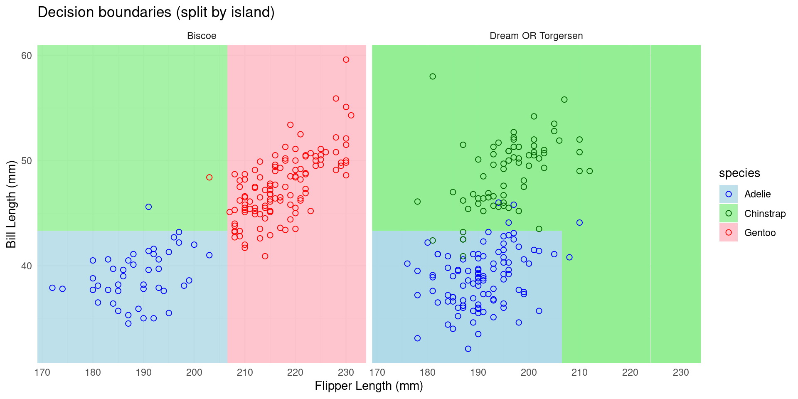
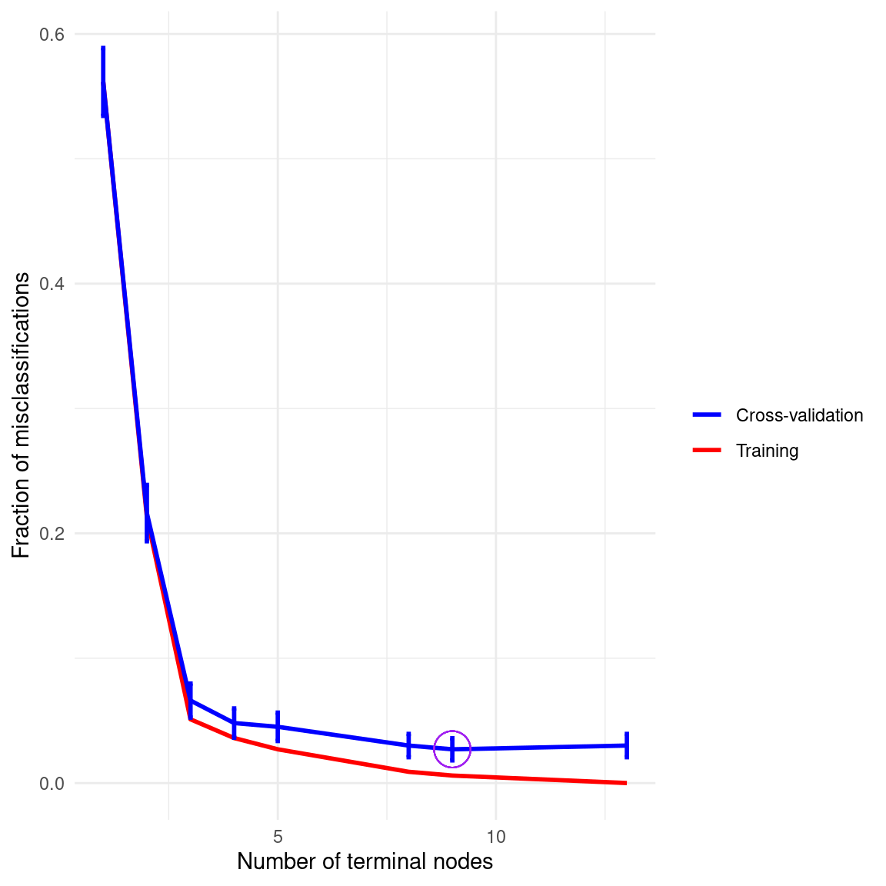
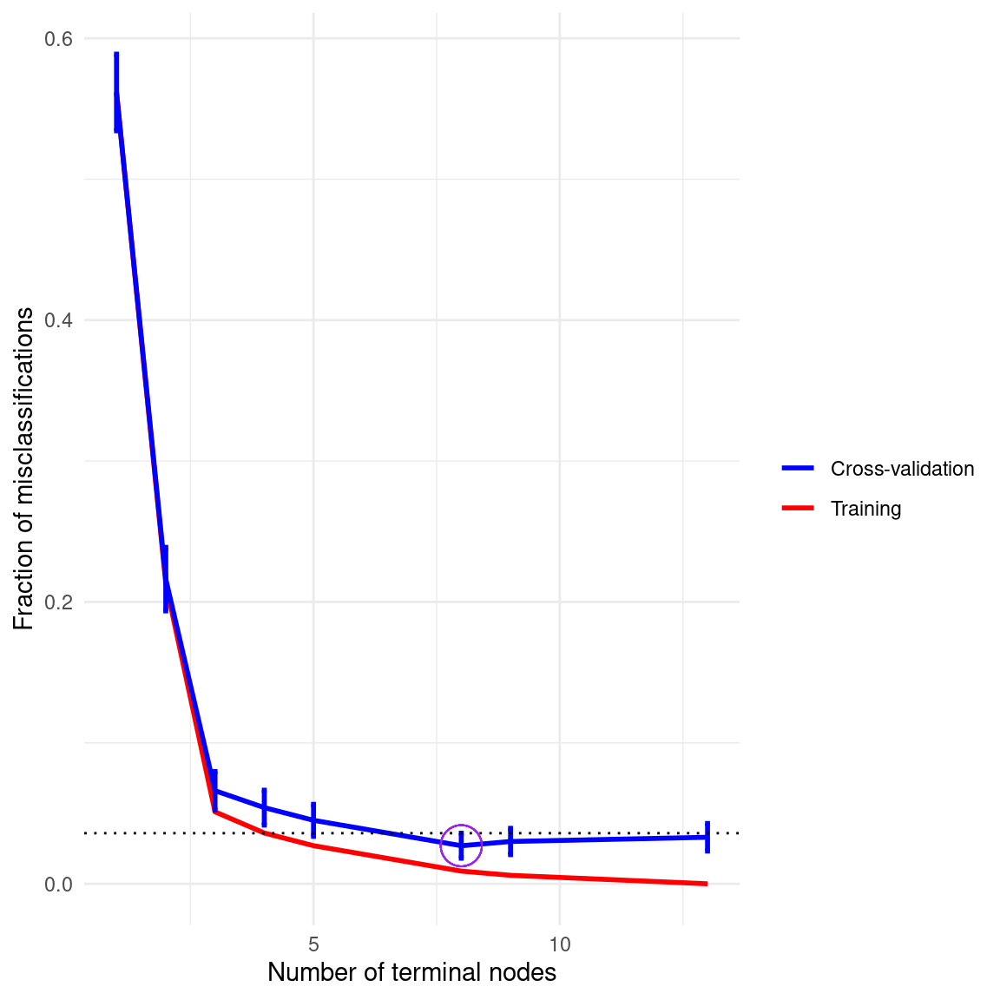
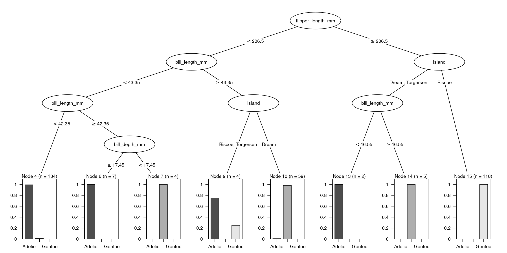
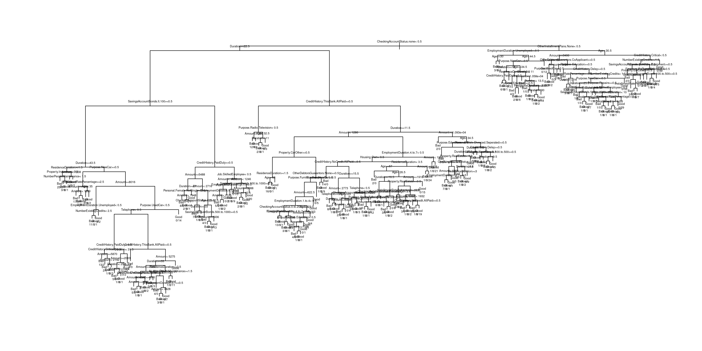

::: {.cell}

:::


# Supervised learning & classification


## Supervised learning

Learn from examples in order to make predictions that generalise to new data.

 

::: fragment
**Supervised Learning**\
- We have a *training* dataset containing some with input features (predictors) $X$ and target labels/outcomes $y$\
- The algorithm learns a function $f(X)$ that predicts $y$ accurately\
- Learning is achieved by minimising a *cost* or *loss* function (i.e. an error metric that tells us how bad the predictions are compared to the observed $y$)\
:::

## Woes of supervised learning

-   **Overfitting**: when the model learns aspects of the training data that are just "noise" and fail to predict well new data.
    -   It can be due to having a model that is too complex (too many free parameter).
    -   Methods like *cross-validation*, and splitting in training/test sets, help monitoring and reducing the chance of overfitting.
    -   If we care about estimating the predictive performance of our model, we need to be careful about leakage of information from test data.
    -   *Regularisation* methods modify the cost function of our model, to favour simpler models and reduce the chance of overfitting.
-   **Dataset bias**: when the training data is incomplete or systematically different from the broader set of future data that we would like to predict.


## Linear regression as a supervised ML algorithm {.scrollable}

::: fragment
Model: $$\hat y = \beta_0 + \beta_1 X_1 + \ldots + \beta_k X_k$$
:::

::: fragment
Residuals errors: $$\epsilon_i = y_i - \hat y_i$$
:::

::: fragment
The *loss* function is the mean squared error: $$\text{Loss} = \underbrace{\frac{1}{n}\sum_{i=1}^n ( y_i - \hat y_i)^2}_{\text{mean squared error}} $$
:::

<!-- ::: fragment -->
<!-- In *regularised* regression the loss function is augmented with a *penalty* term, defined as a function of the regression coefficients $\boldsymbol{\beta}=\{\beta_0, \beta_1, \ldots, \beta_k\}$ -->
<!-- $$\text{Loss} = \underbrace{\frac{1}{n} \sum_{i=1}^{n} \left(y_i - \hat y_i \right)^2}_{\text{mean squared error}} \, + \, \underbrace{\lambda \left[ \alpha \sum |\boldsymbol{\beta}| + (1-\alpha) \sum \boldsymbol{\beta}^2 \right]}_{\text{penalty}}$$ -->
<!-- ::: -->

## Logistic regression as a supervised ML algorithm {.scrollable}

::: fragment
Model (predicting a probability):
$$
\hat p_i = P(y_i = 1 \mid \mathbf X_i)
= \sigma(\beta_0 + \beta_1 X_{i1} + \ldots + \beta_k X_{ik})
$$

where
$$
\sigma(z) = \frac{1}{1 + e^{-z}}
$$
:::

::: fragment
Observed outcome:
$$
y_i \in \{0,1\}
$$

We compare the predicted probability $\hat p_i$ to the true class $y_i$.
:::

 


::: fragment
*Cross-entropy* loss function
$$
\text{Cross-entropy}
= -\frac{1}{n}\sum_{i=1}^n \Big[ y_i \log(\hat p_i)
+ (1 - y_i)\log(1 - \hat p_i) \Big]
$$

:::


## Classification

-   Linear regression require a continuous outcome variables; however in many real world problems our target variables is a categorical label.

-   If the label can only take one of two values (like a coin flip) then we can model our data using logistic regression.

-   Dataset with \>2 labels requires different approaches.


# Decision trees

## Decision trees


::: {.cell layout-align="center"}
::: {.cell-output-display}
{fig-align='center' width=960}
:::
:::


## Decision trees: basic ideas

-   Decision trees *split* the data multiple times according to certain cutoff values in the features/predictors.

-   Starting from the *root* node each subsequent node in the tree implements further split of the data; subsequent splits are connected by AND logical connectives\
    (*if feature* $X$ is \[smaller/bigger\] than threshold AND ... then the predicted class is ...)

-   The splits create a partition of the data into a set of distinct, non-overlapping regions (high-dimensional rectangles or *boxes*), each aiming to contains instances of the same class.

-   The terminal nodes are also known as *leafs*

##  {.smaller .scrollable transition="slide"}


::: {.cell layout-align="center"}
::: {.cell-output-display}
{fig-align='center' width=960}
:::
:::


<!-- ##  {.smaller .scrollable transition="slide"} -->

<!-- ```{r} -->

<!-- #| fig-height: 6 -->

<!-- #| fig-width: 7 -->

<!-- #| fig-align: center -->

<!-- # Remove missing values -->

<!-- penguins <- na.omit(penguins) -->

<!-- # Fit a simple decision tree (pruned for clarity) -->

<!-- p_m <- rpart(species ~ flipper_length_mm + bill_length_mm, data = penguins, method = "class") -->

<!-- # Convert to party object for better visualization -->

<!-- p_m2 <- as.party(p_m) -->

<!-- # Create a grid of values for flipper length and bill length -->

<!-- flipper_seq <- seq(min(penguins$flipper_length_mm)-10, max(penguins$flipper_length_mm)+10, length.out = 200) -->

<!-- bill_seq <- seq(min(penguins$bill_length_mm)-5, max(penguins$bill_length_mm)+5, length.out = 200) -->

<!-- grid <- expand.grid( -->

<!--   flipper_length_mm = flipper_seq, -->

<!--   bill_length_mm = bill_seq -->

<!-- ) -->

<!-- # Predict species for each grid point -->

<!-- grid$species <- predict(p_m, newdata = grid, type = "class") -->

<!-- # Plot the decision boundaries -->

<!-- ggplot() + -->

<!--   geom_tile(data = grid, aes(x = flipper_length_mm, y = bill_length_mm, fill = species), alpha = 0.8) + -->

<!--   geom_point(data = penguins, aes(x = flipper_length_mm, y = bill_length_mm, color = species), pch=21, size = 2) + -->

<!--   labs( -->

<!--     x = "Flipper length (mm)", -->

<!--     y = "Bill length (mm)", -->

<!--     title = "Decision boundaries" -->

<!--   ) + -->

<!--   scale_fill_manual(values = c("Adelie" = "lightblue", "Chinstrap" = "lightgreen", "Gentoo" = "lightpink")) + -->

<!--   scale_color_manual(values = c("Adelie" = "blue", "Chinstrap" = "dark green", "Gentoo" = "red")) + -->

<!--   theme_minimal()+ -->

<!--   coord_cartesian(xlim=range(penguins$flipper_length_mm),ylim=range(penguins$bill_length_mm)) -->

<!-- ``` -->

##  {.smaller .scrollable transition="slide"}


::: {.cell layout-align="center"}
::: {.cell-output-display}
{fig-align='center' width=960}
:::
:::


------------------------------------------------------------------------

## Growing a decision tree {.scrollable}

How do we choose the split? The most popular approach is **recursive binary splitting**, a *top-down, greedy* algorithm:

::: {style="font-size: 80%;"}
-   *top-down* because it starts at the top of the tree
-   *greedy* because it works by optimising the splits *locally*, at each node sequentially, rather than all the splits at once.
:::

1.  Start with a dataset having features $X$ and class labels $y = \left\{ 1, \ldots, k\right\}$
2.  Choose a feature (say $X_j$) and a **threshold** $t$ that best **splits** the data into two subsets, depending on whether $\{x_j \le t \}$ or $\{x_j > t \}$.\
    The **best split** is the one that minimizes an **impurity measure** in child nodes.

::: {style="font-size: 80%;"}
-   Common impurity measure: **Gini index**: $G = 1 - \sum_{k=1}^K p_k^2$
-   Here, $p_k$ is the proportion of class $k$ instances in a node.
-   Gini index is small if all values are close to 0 or 1.
:::

3.  **Repeat** recursively (by splitting one of the previously identified nodes) until some stopping criterion (e.g., max depth, n. of datapoints per leaf) is met.

## Pruning the tree

-   **The tree-growing algorithm is likely to *overfit* the training data**, producing too complex trees that may not generalise well to new data.

-   One could grow the tree only as long as the decrease in the impurity measure due to each split exceeds a relatively high threshold.  However this is too short-sighted --- a seemingly worthless split early on in the tree might be followed by a very good split.

-   A better strategy is to **grow a large tree, and then *prune* it back to a smaller *sub*-tree**, by removing leaf nodes that add little predictive value.

 

-   In practice pruning works as follow:
    1.  set a tuning parameter $\alpha$ penalizes the loss function based on complexity (number of leaf nodes).
    2.  use cross-validation to select a best value for $\alpha$

## 

*Unpruned* tree for `penguins` data


::: {.cell layout-align="center"}
::: {.cell-output-display}
{fig-align='center' width=1248}
:::
:::


## 

Pruning the tree via cross-validation


::: {.cell layout-align="center"}
::: {.cell-output-display}
{fig-align='center' width=576}
:::
:::


## 

### Estimating a decision tree in R (`rpart` package)


::: {.cell}

```{.r .cell-code}
library(rpart)

p_m <- rpart(species~ ., data = penguins)

p_m
```

::: {.cell-output .cell-output-stdout}

```
n= 333 

node), split, n, loss, yval, (yprob)
      * denotes terminal node

1) root 333 187 Adelie (0.438438438 0.204204204 0.357357357)  
  2) flipper_length_mm< 206.5 208  64 Adelie (0.692307692 0.302884615 0.004807692)  
    4) bill_length_mm< 43.35 145   5 Adelie (0.965517241 0.034482759 0.000000000) *
    5) bill_length_mm>=43.35 63   5 Chinstrap (0.063492063 0.920634921 0.015873016) *
  3) flipper_length_mm>=206.5 125   7 Gentoo (0.016000000 0.040000000 0.944000000)  
    6) island=Dream,Torgersen 7   2 Chinstrap (0.285714286 0.714285714 0.000000000) *
    7) island=Biscoe 118   0 Gentoo (0.000000000 0.000000000 1.000000000) *
```


:::
:::


:::: fragment
 

::: {style="font-size: 80%;"}
This tree has 4 terminal leafs (terminal nodes), rather 8 suggested by the cross-validation.\
This is because by default `rpart` does not attempt to split a node if it has 20 datapoints or less.
:::
::::

## 

We can change parameters to allows smaller splits:


::: {.cell}

```{.r .cell-code}
p_m <- rpart(species~ ., data = penguins,
             minsplit = 4,  # minumun N in a node to attempt a split
             xval=50)       # N. of cross-validations

p_m
```

::: {.cell-output .cell-output-stdout}

```
n= 333 

node), split, n, loss, yval, (yprob)
      * denotes terminal node

 1) root 333 187 Adelie (0.438438438 0.204204204 0.357357357)  
   2) flipper_length_mm< 206.5 208  64 Adelie (0.692307692 0.302884615 0.004807692)  
     4) bill_length_mm< 43.35 145   5 Adelie (0.965517241 0.034482759 0.000000000)  
       8) bill_length_mm< 42.35 134   1 Adelie (0.992537313 0.007462687 0.000000000) *
       9) bill_length_mm>=42.35 11   4 Adelie (0.636363636 0.363636364 0.000000000)  
        18) bill_depth_mm>=17.45 7   0 Adelie (1.000000000 0.000000000 0.000000000) *
        19) bill_depth_mm< 17.45 4   0 Chinstrap (0.000000000 1.000000000 0.000000000) *
     5) bill_length_mm>=43.35 63   5 Chinstrap (0.063492063 0.920634921 0.015873016)  
      10) island=Biscoe,Torgersen 4   1 Adelie (0.750000000 0.000000000 0.250000000) *
      11) island=Dream 59   1 Chinstrap (0.016949153 0.983050847 0.000000000) *
   3) flipper_length_mm>=206.5 125   7 Gentoo (0.016000000 0.040000000 0.944000000)  
     6) island=Dream,Torgersen 7   2 Chinstrap (0.285714286 0.714285714 0.000000000)  
      12) bill_length_mm< 46.55 2   0 Adelie (1.000000000 0.000000000 0.000000000) *
      13) bill_length_mm>=46.55 5   0 Chinstrap (0.000000000 1.000000000 0.000000000) *
     7) island=Biscoe 118   0 Gentoo (0.000000000 0.000000000 1.000000000) *
```


:::
:::


:::: fragment
::: {style="font-size: 80%;"}
Now the tree has 8 leafs (which correspond to the minimum of the cross-validation error as shown in the cross-validation plot)
:::
::::

## 

::: {style="font-size: 80%;"}
-   In practice `rpart` would choose the simplest model that is within 1 standard error from the minimum, rather than the minimum itself.
-   (The error typically shows a sharp drop followed by a flat plateau; so the 1 - SE rule allows to choose the simplest model among all those "tied" on the plateau)
:::


::: {.cell layout-align="center"}
::: {.cell-output-display}
{fig-align='center' width=576}
:::
:::


## 

*Pruned* tree for `penguins` data, after allowing split also in nodes with as little as `minsplit = 4` observations.


::: {.cell layout-align="center"}
::: {.cell-output-display}
{fig-align='center' width=1248}
:::
:::


##  {.scrollable}

The `summary()` function provides further information


::: {.cell}

```{.r .cell-code}
summary(p_m)
```

::: {.cell-output .cell-output-stdout}

```
Call:
rpart(formula = species ~ ., data = penguins, minsplit = 4, xval = 50)
  n= 333 

          CP nsplit  rel error     xerror       xstd
1 0.62032086      0 1.00000000 1.00000000 0.04842097
2 0.28877005      1 0.37967914 0.38502674 0.04017194
3 0.02673797      2 0.09090909 0.11764706 0.02423973
4 0.01604278      3 0.06417112 0.08556150 0.02087017
5 0.01069519      4 0.04812834 0.08556150 0.02087017
6 0.01000000      7 0.01604278 0.06951872 0.01890092

Variable importance
flipper_length_mm    bill_length_mm     bill_depth_mm       body_mass_g 
               21                21                18                16 
           island           island2 
               14                11 

Node number 1: 333 observations,    complexity param=0.6203209
  predicted class=Adelie     expected loss=0.5615616  P(node) =1
    class counts:   146    68   119
   probabilities: 0.438 0.204 0.357 
  left son=2 (208 obs) right son=3 (125 obs)
  Primary splits:
      flipper_length_mm < 206.5  to the left,  improve=109.97940, (0 missing)
      bill_length_mm    < 42.35  to the left,  improve=102.52910, (0 missing)
      bill_depth_mm     < 16.45  to the right, improve= 96.64493, (0 missing)
      body_mass_g       < 4525   to the left,  improve= 83.06712, (0 missing)
      island            splits as  RLL,        improve= 66.73118, (0 missing)
  Surrogate splits:
      bill_depth_mm  < 16.35  to the right, agree=0.931, adj=0.816, (0 split)
      body_mass_g    < 4525   to the left,  agree=0.907, adj=0.752, (0 split)
      island         splits as  RLL,        agree=0.844, adj=0.584, (0 split)
      island2        splits as  RL,         agree=0.844, adj=0.584, (0 split)
      bill_length_mm < 43.25  to the left,  agree=0.784, adj=0.424, (0 split)

Node number 2: 208 observations,    complexity param=0.2887701
  predicted class=Adelie     expected loss=0.3076923  P(node) =0.6246246
    class counts:   144    63     1
   probabilities: 0.692 0.303 0.005 
  left son=4 (145 obs) right son=5 (63 obs)
  Primary splits:
      bill_length_mm    < 43.35  to the left,  improve=70.232650, (0 missing)
      island            splits as  LRL,        improve=29.089290, (0 missing)
      island2           splits as  LR,         improve= 9.964985, (0 missing)
      flipper_length_mm < 192.5  to the left,  improve= 8.887353, (0 missing)
      body_mass_g       < 3225   to the left,  improve= 2.340859, (0 missing)
  Surrogate splits:
      flipper_length_mm < 195.5  to the left,  agree=0.740, adj=0.143, (0 split)
      island            splits as  LRL,        agree=0.702, adj=0.016, (0 split)

Node number 3: 125 observations,    complexity param=0.02673797
  predicted class=Gentoo     expected loss=0.056  P(node) =0.3753754
    class counts:     2     5   118
   probabilities: 0.016 0.040 0.944 
  left son=6 (7 obs) right son=7 (118 obs)
  Primary splits:
      island         splits as  RLL,        improve=10.518860, (0 missing)
      bill_depth_mm  < 17.65  to the right, improve=10.518860, (0 missing)
      island2        splits as  RL,         improve=10.518860, (0 missing)
      body_mass_g    < 4125   to the left,  improve= 4.692667, (0 missing)
      bill_length_mm < 40.85  to the left,  improve= 1.876000, (0 missing)
  Surrogate splits:
      bill_depth_mm < 17.65  to the right, agree=1.000, adj=1.000, (0 split)
      body_mass_g   < 4125   to the left,  agree=0.968, adj=0.429, (0 split)

Node number 4: 145 observations,    complexity param=0.01069519
  predicted class=Adelie     expected loss=0.03448276  P(node) =0.4354354
    class counts:   140     5     0
   probabilities: 0.966 0.034 0.000 
  left son=8 (134 obs) right son=9 (11 obs)
  Primary splits:
      bill_length_mm    < 42.35  to the left,  improve=2.5791890, (0 missing)
      bill_depth_mm     < 16.75  to the right, improve=1.0019550, (0 missing)
      flipper_length_mm < 187.5  to the right, improve=0.5480296, (0 missing)
      island            splits as  LRL,        improve=0.5172414, (0 missing)
      body_mass_g       < 3375   to the right, improve=0.4548910, (0 missing)
  Surrogate splits:
      body_mass_g < 4687.5 to the left,  agree=0.931, adj=0.091, (0 split)

Node number 5: 63 observations,    complexity param=0.01604278
  predicted class=Chinstrap  expected loss=0.07936508  P(node) =0.1891892
    class counts:     4    58     1
   probabilities: 0.063 0.921 0.016 
  left son=10 (4 obs) right son=11 (59 obs)
  Primary splits:
      island         splits as  LRL,        improve=5.867232, (0 missing)
      body_mass_g    < 4125   to the right, improve=2.833333, (0 missing)
      island2        splits as  RL,         improve=2.628415, (0 missing)
      bill_depth_mm  < 15.4   to the right, improve=1.849462, (0 missing)
      bill_length_mm < 46.05  to the left,  improve=1.659864, (0 missing)
  Surrogate splits:
      body_mass_g < 4575   to the right, agree=0.968, adj=0.5, (0 split)
      island2     splits as  LR,         agree=0.968, adj=0.5, (0 split)

Node number 6: 7 observations,    complexity param=0.01069519
  predicted class=Chinstrap  expected loss=0.2857143  P(node) =0.02102102
    class counts:     2     5     0
   probabilities: 0.286 0.714 0.000 
  left son=12 (2 obs) right son=13 (5 obs)
  Primary splits:
      bill_length_mm    < 46.55  to the left,  improve=2.8571430, (0 missing)
      bill_depth_mm     < 18.95  to the left,  improve=2.8571430, (0 missing)
      island            splits as  -RL,        improve=1.1904760, (0 missing)
      flipper_length_mm < 209    to the left,  improve=0.2571429, (0 missing)
      body_mass_g       < 3975   to the right, improve=0.1904762, (0 missing)
  Surrogate splits:
      bill_depth_mm < 18.95  to the left,  agree=1, adj=1, (0 split)

Node number 7: 118 observations
  predicted class=Gentoo     expected loss=0  P(node) =0.3543544
    class counts:     0     0   118
   probabilities: 0.000 0.000 1.000 

Node number 8: 134 observations
  predicted class=Adelie     expected loss=0.007462687  P(node) =0.4024024
    class counts:   133     1     0
   probabilities: 0.993 0.007 0.000 

Node number 9: 11 observations,    complexity param=0.01069519
  predicted class=Adelie     expected loss=0.3636364  P(node) =0.03303303
    class counts:     7     4     0
   probabilities: 0.636 0.364 0.000 
  left son=18 (7 obs) right son=19 (4 obs)
  Primary splits:
      bill_depth_mm     < 17.45  to the right, improve=5.090909, (0 missing)
      flipper_length_mm < 189.5  to the right, improve=5.090909, (0 missing)
      sex               splits as  RL,         improve=5.090909, (0 missing)
      island            splits as  LRL,        improve=3.490909, (0 missing)
      body_mass_g       < 3837.5 to the right, improve=3.490909, (0 missing)
  Surrogate splits:
      flipper_length_mm < 189.5  to the right, agree=1.000, adj=1.00, (0 split)
      body_mass_g       < 3425   to the right, agree=0.909, adj=0.75, (0 split)
      bill_length_mm    < 42.6   to the right, agree=0.818, adj=0.50, (0 split)
      year              < 2007.5 to the right, agree=0.727, adj=0.25, (0 split)

Node number 10: 4 observations
  predicted class=Adelie     expected loss=0.25  P(node) =0.01201201
    class counts:     3     0     1
   probabilities: 0.750 0.000 0.250 

Node number 11: 59 observations
  predicted class=Chinstrap  expected loss=0.01694915  P(node) =0.1771772
    class counts:     1    58     0
   probabilities: 0.017 0.983 0.000 

Node number 12: 2 observations
  predicted class=Adelie     expected loss=0  P(node) =0.006006006
    class counts:     2     0     0
   probabilities: 1.000 0.000 0.000 

Node number 13: 5 observations
  predicted class=Chinstrap  expected loss=0  P(node) =0.01501502
    class counts:     0     5     0
   probabilities: 0.000 1.000 0.000 

Node number 18: 7 observations
  predicted class=Adelie     expected loss=0  P(node) =0.02102102
    class counts:     7     0     0
   probabilities: 1.000 0.000 0.000 

Node number 19: 4 observations
  predicted class=Chinstrap  expected loss=0  P(node) =0.01201201
    class counts:     0     4     0
   probabilities: 0.000 1.000 0.000 
```


:::
:::


## 

Notes on `summary()` output

-   **Primary vs *surrogate* splits**: surrogate splits are rules to make decisions when the variables in a split point is missing

-   **Variable importance** summarise how useful is a variable for prediction (based on unpruned tree and including surrogate splits)

## Plotting trees (1)


::: {.cell layout-align="center"}

```{.r .cell-code}
par(xpd = TRUE)
plot(p_m, compress= TRUE)
text(p_m, use.n = TRUE, cex=0.8)
```

::: {.cell-output-display}
{fig-align='center' width=768}
:::
:::


::: {style="font-size: 80%;"}
See `?plot.rpart` for available options.
:::

## Plotting trees (2) {.scrollable transition="convex"}

Using the `rpart.plot` library.


::: {.cell layout-align="center"}

```{.r .cell-code}
library(rpart.plot)
rpart.plot(p_m)
```

::: {.cell-output-display}
{fig-align='center' width=768}
:::
:::


::: {style="font-size: 80%;"}
See `?rpart.plot` for options.
:::

## Plotting trees (3) {.scrollable transition="convex"}

Using the `partykit` library.


::: {.cell layout-align="center"}

```{.r .cell-code}
library(partykit)
p_m2 <- as.party(p_m)

plot(p_m2, 
     terminal_panel =  node_barplot(p_m2, gp = gpar(fontsize=8)),
     inner_panel = node_inner(p_m2, id = FALSE),
     gp=gpar(fontsize=8))
```

::: {.cell-output-display}
{fig-align='center' width=1152}
:::
:::


## Confusion matrix {.scrollable}

A way to examine the accuracy of classification (*note that the this would be accuracy on the training set; to assess predictive accuracy for new, unseen data we need to use something like cross-validation*)


::: {.cell}

```{.r .cell-code}
# fit tree
p_m <- rpart(species~ ., data = penguins)

# compute predictions on training set
predictions <- predict(p_m, penguins, type = "class")

# compute confusion matrix
library(caret)
conf_mat <- confusionMatrix(predictions, penguins$species)

print(conf_mat)
```

::: {.cell-output .cell-output-stdout}

```
Confusion Matrix and Statistics

           Reference
Prediction  Adelie Chinstrap Gentoo
  Adelie       140         5      0
  Chinstrap      6        63      1
  Gentoo         0         0    118

Overall Statistics
                                          
               Accuracy : 0.964           
                 95% CI : (0.9379, 0.9812)
    No Information Rate : 0.4384          
    P-Value [Acc > NIR] : < 2.2e-16       
                                          
                  Kappa : 0.9437          
                                          
 Mcnemar's Test P-Value : NA              

Statistics by Class:

                     Class: Adelie Class: Chinstrap Class: Gentoo
Sensitivity                 0.9589           0.9265        0.9916
Specificity                 0.9733           0.9736        1.0000
Pos Pred Value              0.9655           0.9000        1.0000
Neg Pred Value              0.9681           0.9810        0.9953
Prevalence                  0.4384           0.2042        0.3574
Detection Rate              0.4204           0.1892        0.3544
Detection Prevalence        0.4354           0.2102        0.3544
Balanced Accuracy           0.9661           0.9500        0.9958
```


:::
:::


## Plotting a confusion matrix


::: {.cell layout-align="center"}

```{.r .cell-code}
# Convert confusion matrix to a data frame for ggplot
conf_df <- as.data.frame(conf_mat$table)

# Create a heatmap plot
ggplot(conf_df, aes(x = Prediction, y = Reference, fill = Freq)) +
  geom_tile() +
  geom_text(aes(label = Freq), color = "white", size = 5) +  # Add text labels
  scale_fill_gradient(low = "blue", high = "red") +  # Color scale
  labs(title = "Confusion Matrix",
       x = "Predicted Class",
       y = "Actual Class") +
  coord_equal() +
  theme_minimal()
```

::: {.cell-output-display}
{fig-align='center' width=480}
:::
:::


## A more complex example: `GermanCredit` dataset {.scrollable}


::: {.cell}
::: {.cell-output .cell-output-stdout}

```
'data.frame':	1000 obs. of  62 variables:
 $ Duration                              : int  6 48 12 42 24 36 24 36 12 30 ...
 $ Amount                                : int  1169 5951 2096 7882 4870 9055 2835 6948 3059 5234 ...
 $ InstallmentRatePercentage             : int  4 2 2 2 3 2 3 2 2 4 ...
 $ ResidenceDuration                     : int  4 2 3 4 4 4 4 2 4 2 ...
 $ Age                                   : int  67 22 49 45 53 35 53 35 61 28 ...
 $ NumberExistingCredits                 : int  2 1 1 1 2 1 1 1 1 2 ...
 $ NumberPeopleMaintenance               : int  1 1 2 2 2 2 1 1 1 1 ...
 $ Telephone                             : num  0 1 1 1 1 0 1 0 1 1 ...
 $ ForeignWorker                         : num  1 1 1 1 1 1 1 1 1 1 ...
 $ Class                                 : Factor w/ 2 levels "Bad","Good": 2 1 2 2 1 2 2 2 2 1 ...
 $ CheckingAccountStatus.lt.0            : num  1 0 0 1 1 0 0 0 0 0 ...
 $ CheckingAccountStatus.0.to.200        : num  0 1 0 0 0 0 0 1 0 1 ...
 $ CheckingAccountStatus.gt.200          : num  0 0 0 0 0 0 0 0 0 0 ...
 $ CheckingAccountStatus.none            : num  0 0 1 0 0 1 1 0 1 0 ...
 $ CreditHistory.NoCredit.AllPaid        : num  0 0 0 0 0 0 0 0 0 0 ...
 $ CreditHistory.ThisBank.AllPaid        : num  0 0 0 0 0 0 0 0 0 0 ...
 $ CreditHistory.PaidDuly                : num  0 1 0 1 0 1 1 1 1 0 ...
 $ CreditHistory.Delay                   : num  0 0 0 0 1 0 0 0 0 0 ...
 $ CreditHistory.Critical                : num  1 0 1 0 0 0 0 0 0 1 ...
 $ Purpose.NewCar                        : num  0 0 0 0 1 0 0 0 0 1 ...
 $ Purpose.UsedCar                       : num  0 0 0 0 0 0 0 1 0 0 ...
 $ Purpose.Furniture.Equipment           : num  0 0 0 1 0 0 1 0 0 0 ...
 $ Purpose.Radio.Television              : num  1 1 0 0 0 0 0 0 1 0 ...
 $ Purpose.DomesticAppliance             : num  0 0 0 0 0 0 0 0 0 0 ...
 $ Purpose.Repairs                       : num  0 0 0 0 0 0 0 0 0 0 ...
 $ Purpose.Education                     : num  0 0 1 0 0 1 0 0 0 0 ...
 $ Purpose.Vacation                      : num  0 0 0 0 0 0 0 0 0 0 ...
 $ Purpose.Retraining                    : num  0 0 0 0 0 0 0 0 0 0 ...
 $ Purpose.Business                      : num  0 0 0 0 0 0 0 0 0 0 ...
 $ Purpose.Other                         : num  0 0 0 0 0 0 0 0 0 0 ...
 $ SavingsAccountBonds.lt.100            : num  0 1 1 1 1 0 0 1 0 1 ...
 $ SavingsAccountBonds.100.to.500        : num  0 0 0 0 0 0 0 0 0 0 ...
 $ SavingsAccountBonds.500.to.1000       : num  0 0 0 0 0 0 1 0 0 0 ...
 $ SavingsAccountBonds.gt.1000           : num  0 0 0 0 0 0 0 0 1 0 ...
 $ SavingsAccountBonds.Unknown           : num  1 0 0 0 0 1 0 0 0 0 ...
 $ EmploymentDuration.lt.1               : num  0 0 0 0 0 0 0 0 0 0 ...
 $ EmploymentDuration.1.to.4             : num  0 1 0 0 1 1 0 1 0 0 ...
 $ EmploymentDuration.4.to.7             : num  0 0 1 1 0 0 0 0 1 0 ...
 $ EmploymentDuration.gt.7               : num  1 0 0 0 0 0 1 0 0 0 ...
 $ EmploymentDuration.Unemployed         : num  0 0 0 0 0 0 0 0 0 1 ...
 $ Personal.Male.Divorced.Seperated      : num  0 0 0 0 0 0 0 0 1 0 ...
 $ Personal.Female.NotSingle             : num  0 1 0 0 0 0 0 0 0 0 ...
 $ Personal.Male.Single                  : num  1 0 1 1 1 1 1 1 0 0 ...
 $ Personal.Male.Married.Widowed         : num  0 0 0 0 0 0 0 0 0 1 ...
 $ Personal.Female.Single                : num  0 0 0 0 0 0 0 0 0 0 ...
 $ OtherDebtorsGuarantors.None           : num  1 1 1 0 1 1 1 1 1 1 ...
 $ OtherDebtorsGuarantors.CoApplicant    : num  0 0 0 0 0 0 0 0 0 0 ...
 $ OtherDebtorsGuarantors.Guarantor      : num  0 0 0 1 0 0 0 0 0 0 ...
 $ Property.RealEstate                   : num  1 1 1 0 0 0 0 0 1 0 ...
 $ Property.Insurance                    : num  0 0 0 1 0 0 1 0 0 0 ...
 $ Property.CarOther                     : num  0 0 0 0 0 0 0 1 0 1 ...
 $ Property.Unknown                      : num  0 0 0 0 1 1 0 0 0 0 ...
 $ OtherInstallmentPlans.Bank            : num  0 0 0 0 0 0 0 0 0 0 ...
 $ OtherInstallmentPlans.Stores          : num  0 0 0 0 0 0 0 0 0 0 ...
 $ OtherInstallmentPlans.None            : num  1 1 1 1 1 1 1 1 1 1 ...
 $ Housing.Rent                          : num  0 0 0 0 0 0 0 1 0 0 ...
 $ Housing.Own                           : num  1 1 1 0 0 0 1 0 1 1 ...
 $ Housing.ForFree                       : num  0 0 0 1 1 1 0 0 0 0 ...
 $ Job.UnemployedUnskilled               : num  0 0 0 0 0 0 0 0 0 0 ...
 $ Job.UnskilledResident                 : num  0 0 1 0 0 1 0 0 1 0 ...
 $ Job.SkilledEmployee                   : num  1 1 0 1 1 0 1 0 0 0 ...
 $ Job.Management.SelfEmp.HighlyQualified: num  0 0 0 0 0 0 0 1 0 1 ...
```


:::
:::


## 

Estimated decision tree (with pruning)


::: {.cell layout-align="center"}

```{.r .cell-code}
credit_tree <- rpart(Class  ~ ., data = GermanCredit, xval=100)

plot(credit_tree)
text(credit_tree, use.n = TRUE, cex=0.9)
```

::: {.cell-output-display}
{fig-align='center' width=1536}
:::
:::


## 

Unpruned tree


::: {.cell layout-align="center"}

```{.r .cell-code}
credit_tree <- rpart(Class  ~ ., data = GermanCredit,
                     cp = 0, minsplit = 2)

plot(credit_tree)
text(credit_tree, use.n = TRUE, cex=0.4)
```

::: {.cell-output-display}
{fig-align='center' width=1536}
:::
:::


## Exercise

-   Use one of the dataset for classification in the 'coursework' folder on Moodle and fit a decision tree model.


##  {.scrollable}

#### Advantages

-   **Interpretability**: trees are easy to visualize, interpret and explain.

-   **Flexibility**: trees can easily handle many types of variables; they can also be used for regression (are also known as classification and regression trees, or CART).

-   **Nonlinear Boundaries**: trees naturally model complex, non-linear relationships.

::: fragment
#### Disadvantages

-   For regression, decision trees approximate linear relationships with *piecewise* functions, which can be inefficient compared to direct linear modeling. They also lack *smoothness* — a small change in a feature can push it past a threshold, causing a sudden jump in predictions.

-   **Non-robust**: a small change in the training data can create a large difference in the final estimated tree\
    (each split depends on the *parent* split, and if a different root node is selected the whole tree will be different).
:::

# Ensemble methods

## Ensemble methods to improve robustness

-   Trees suffer from *high variance*: if we split the training data into two parts at random, and fit a decision tree to both halves, the results that we get could be quite different.

-   One approach to improve robustness is *bootstrap aggregation* or *bagging*:

    1.  take repeated samples (with replacement) from the training data (*bootstrapping*)
    2.  train a tree on each of these *bootstrapped* dataset
    3.  combine the predictions (*mojority vote*)

-   Bagging can be used to combine together hundreds or thousands of trees in a single procedure, and can give more robust and accurate results.

## Random forests

-   Random forests provide a further improvements over bagged trees: in addition to resampling the observations (the rows in our data) in each resampled training dataset we include only a subset of the predictor variables.

-   This small tweak decorrelate the trees in each resampled dataset and make the ensemble even less variable and more robust.

-   Particularly helpful when we hav a large number of correlated predictors

{fig-align="center" width="60%"}

## Random forests in R


::: {.cell}

```{.r .cell-code}
library(randomForest)

# Fit Random Forest model
rf_model <- randomForest(species ~ ., data = penguins, ntree = 500, importance = TRUE)

# Print summary
print(rf_model)
```

::: {.cell-output .cell-output-stdout}

```

Call:
 randomForest(formula = species ~ ., data = penguins, ntree = 500,      importance = TRUE) 
               Type of random forest: classification
                     Number of trees: 500
No. of variables tried at each split: 2

        OOB estimate of  error rate: 0.9%
Confusion matrix:
          Adelie Chinstrap Gentoo class.error
Adelie       145         1      0 0.006849315
Chinstrap      2        66      0 0.029411765
Gentoo         0         0    119 0.000000000
```


:::
:::


-   One advantage of random forest is that they provide automatically an estimate of predictive performance.
-   On average each boostrapped dataset include about 2/3 of training data, and we can assess how well the model predict the remaining 1/3 of data (Out-of-Bag, or OOB accuracy).

## OOB confusion matrix

We can use a confusion matrix to assess the out-of-bag predictive accuracy


::: {.cell layout-align="center"}

```{.r .cell-code}
ggplot(data = as.data.frame(conf_mat$table), aes(Prediction, Reference, fill = Freq)) +
  geom_tile() +
  geom_text(aes(label = Freq), color = "white", size = 5) +
  scale_fill_gradient(low = "blue", high = "red") +
  labs(title = "Confusion Matrix",
       x = "Predicted Class",
       y = "Actual Class") +
  coord_equal() +
  theme_minimal()
```

::: {.cell-output-display}
{fig-align='center' width=480}
:::
:::


## Boosting

-   Boosting is also an ensemble method, in the sense that combine many models to produce a result that is more accurate and robust.

-   However, rather than combining many decision trees that were estimated independently, boosting work by sequentially improving a single model, focusing in particular in areas where it does not perform well.

-   A state-of-the-art improvement of boosting is gradient boosting, and is implemented in the R package [`xgboost`](https://xgboost.readthedocs.io/en/stable/#)


::: {.cell}

:::
