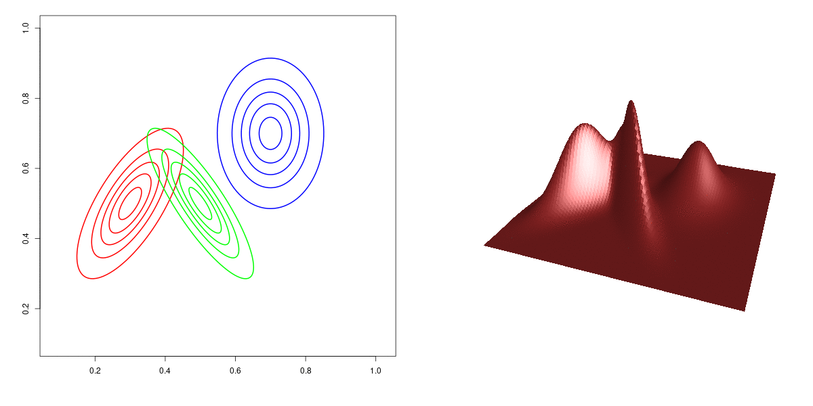
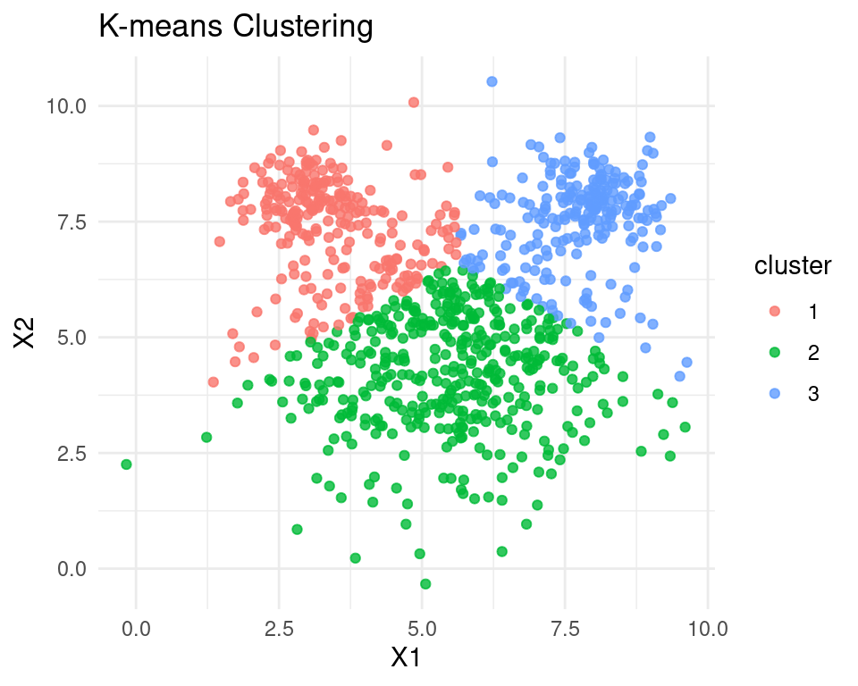
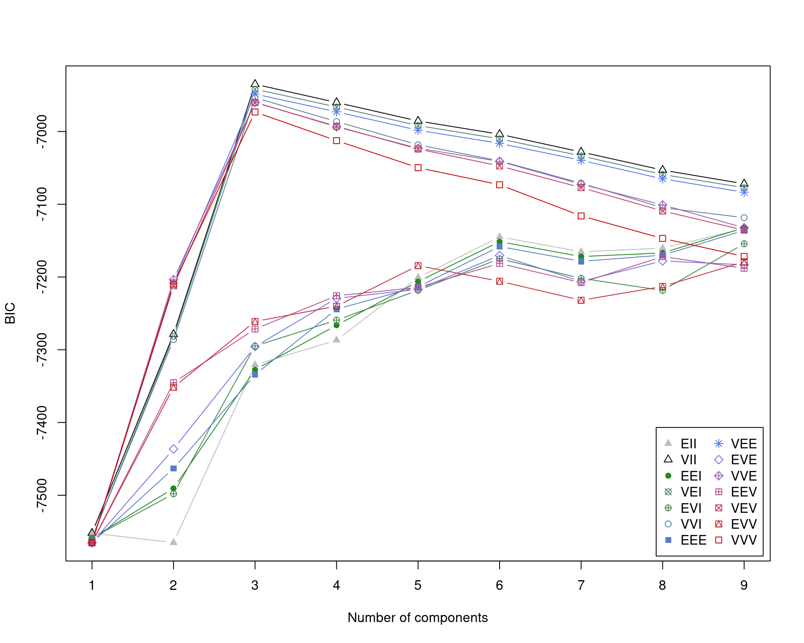
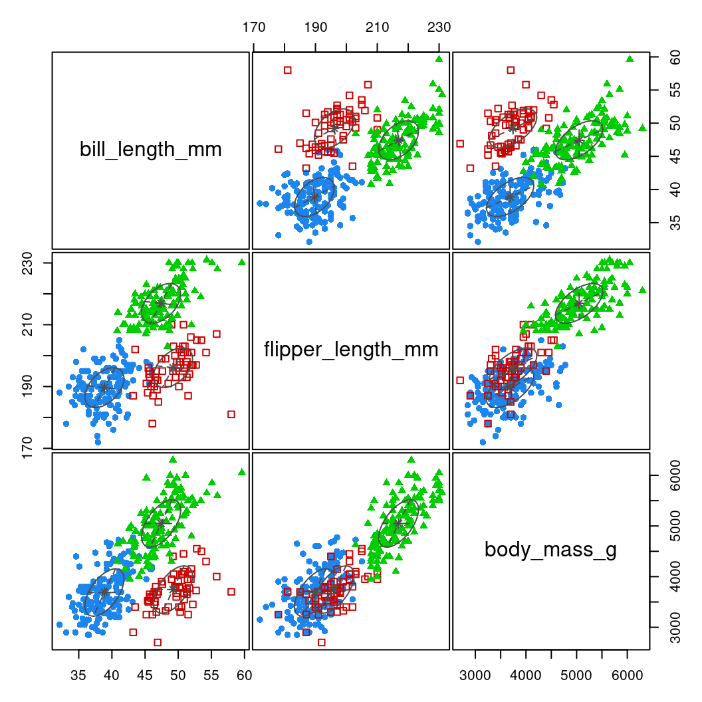
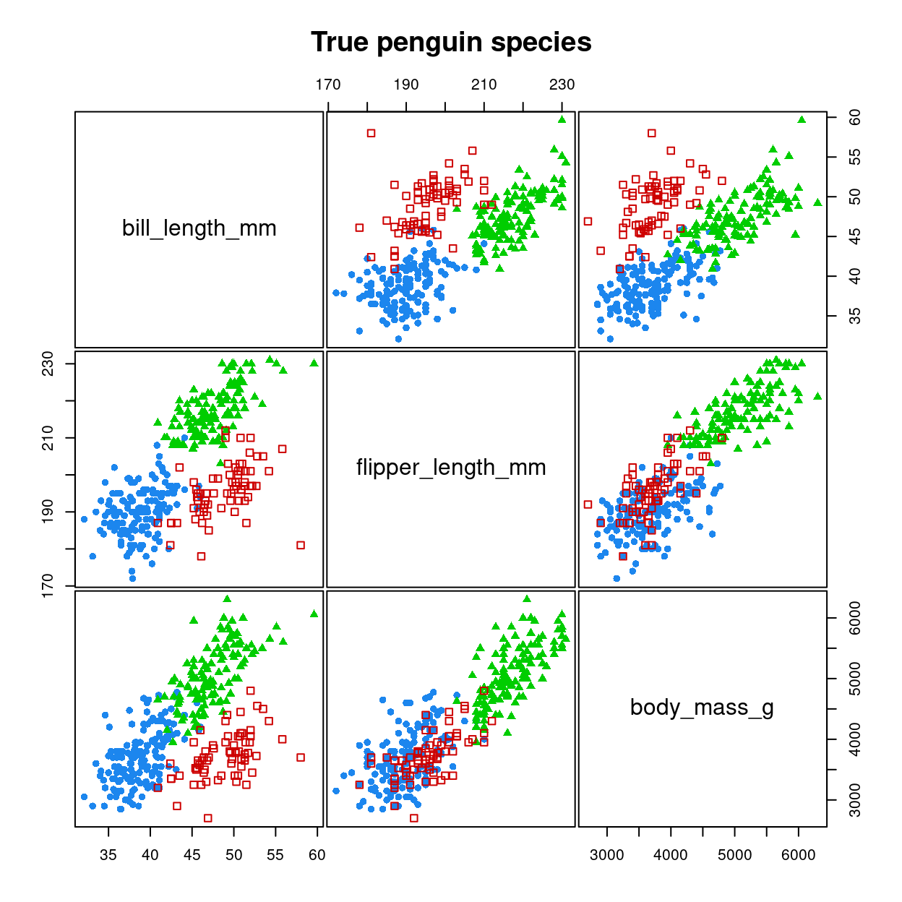

## Supervised vs. unsupervised learning

 

::: nonincremental
-   **Supervised learning:** training data contains a set of input features (predictors) and target labels/outcome.

-   **Unsupervised learning:** learning patterns from *unlabeled data*.
:::

## Supervised vs. unsupervised learning

 

::: fragment
**Supervised Learning**\
- We have a *training* dataset containing some with input features $X$ and target labels/outcomes $y$\
- The algorithm learns a function $f(X)$ that predicts $y$ accurately\
- Learning is achieved by minimising a *cost* or *loss* function (i.e. an error metric that tells us how bad the predictions are compared to the observed $y$)\
- Examples: **Regression** (continuous outcomes), **Classification** (categorical outcomes)
:::

 

::: fragment
**Unsupervised Learning**\
- We only have input features $X$, with no labeled outcome\
- The algorithm finds structure in the data (e.g., clusters, latent factors)\
- Much less well-defined problem since we don't know usually know in advance what to look for.\
- Examples: **Clustering** (e.g., gaussian mixture models), **Dimensionality Reduction** (PCA)
:::

## Unsupervised learning: some examples

-   **Clustering**\
    Divides the training set into groups of similar examples. Each example should be more similar to examples in its group than to other groups.

-   **Dimensionality reduction**\
    Transform high-dimensional data (e.g. many features/predictors) into a lower-dimensional representation that still retain some meaningful properties of original data.\
    Example in psychology: exploratory factor analysis.

-   **Density estimation**\
    Learn a probability distribution (probability *density* function or *pdf*) from data.

-   **Representation learning**\
    Learn structured representations from raw data, often mapping high-dimensional categorical data into a continuous space.\
    Example: large language models (LLM) like ChatGPT represent words as "dense vector embeddings" --- sets of numbers that indicate where a word lies along different semantic dimensions.

##

::: nonincremental

**Clustering examples:**

- **Personality types:**
  - Identify distinct personality profiles based on questionnaire responses.
  - Example: clustering Big Five traits into personality "types."

- **Mental health diagnostics:**
  - Discover patient subgroups based on symptom patterns for tailored interventions.

- **Behavioral data segmentation:**
  - Group participants based on response patterns or other measures.

:::


## A simple clustering algorithm: $k$-means

-   Partition the data into $k$ categories (clusters).
-   The "$k$" denotes the requested number of clusters (a parameter that is set from the user).

::: fragment
::: columns
::: {.column width="50%"}
::: {style="font-size: 70%;"}
-   Start by creating $k$ cluster at random, each defined by the coordinates of its mean value (*centroid*).

-   Alternate between two steps:

    1.  **Assignment step**: assign each datapoint to the cluster with the nearest centroid.
    2.  **Update step**: recalculate the mean (centroid) of each cluster from the datapoints assigned to it.

-   Stop when the *cost* function — sum of within-cluster squared errors (distances from centroid) cannot be improved anymore.
:::
:::

::: {.column width="50%"}
{fig-align="center"}
:::
:::
:::

::: notes
The k-means process is interrupted at each iteration after updating the means. The Voronoi cells (black lines) are drawn with the new means, but the points labels are still from the previous iteration (i.e. assigned to the closest mean of the previous iteration). This is why the black lines are already one iteration ahead (the Voronoi cells are only computed in visualization, k-means does not compute them). This can be a bit irritating, but it is a fact that the result, until converged, is never completely consistent: either points are not assigned to the nearest center, or the center is not the mean of the assigned points. Once we have both properties, it has converged.
:::

## Limitations of $k$-means clustering

 

-   **"Hard" clustering method**: each point is assigned to one and only one cluster; there is _no uncertainty measure_ that tells us how confident we can be in the cluster assignment of each point.

-   **No flexibility in cluster's shape**: $k$-means tend to find only clusters of similar shape and spatial extent


::: fragment
::: {style="font-size: 70%;"}
Other (less important) limitations of $k$-means clustering are its sensitivity to initialization and to outliers.

:::
:::


## Gaussian Mixture Models (GMM)

- Some of these limitations can be overcome with a more sophisticated, _probabilistic_ characterization of clusters.

- In this approach, known as _mixture modelling_ we assume that the data comes from a set of distinct sub-populations, each with its own characteristics. When these sub-populations are assumed to be Gaussian, we have a _Gaussian Mixture Model_ or _GMM_.

::: fragment

{fig-align="center"}


:::

## Gaussian Mixture Models (GMM)

- For this to work, we need more than just a centroid to represent each cluster/sub-population:

    - the [mean]{.underline};
    - the [variance-covariance matrix]{.underline}


## Gaussian distribution (recap) {background-color="#202A30"}

 

**Simple _univariate_ Gaussian distribution**

 

::: fragment
Unbounded, bell-shaped distribution, characterised by two parameters: the mean ($\mu$) and the standard deviation ($\sigma$)
:::

 

:::: columns
::: {.column width="50%"}

 
 
 

::: fragment

$x \sim \mathcal{N}(\mu=1, \sigma=2)$

:::

 
 
 

::: fragment

$p(x) =  \frac{1}{\sigma \sqrt{2 \pi}} e^{-\frac{1}{2}\left(\frac{x-\mu}{\sigma}\right)^2}$

:::

:::

::: {.column width="50%"}

::: fragment


::: {.cell layout-align="center"}
::: {.cell-output-display}
{fig-align='center' width=480}
:::
:::


:::

:::
::::


## Gaussian distribution (recap) {background-color="#202A30"}

 

**_Multivariate_ Gaussian distribution**

A generalization of the Gaussian distribution to data with more than one dimension/component:

- Each datapoint is represented as a vector, i.e., an ordered set of numbers (one for each dimension).
- Each dimension/component has its own mean.
- Instead of a single standard deviation, we use a variance-covariance matrix, which specifies:

    - the variance (spread) for each dimension,
    - the covariance (correlation) between dimensions.


## {.scrollable background-color="#202A30" transition="slide"}

**Variance-covariance matrix example:**

 

For a bivariate Gaussian (2 components, $x_1$ and $x_2$), $\left[x_1, x_2 \right] \sim \mathcal{N}(\left[\mu_1, \mu_2\right], \Omega)$, we have a 2-by-2 variance-covariance matrix:

 

::: fragment

$$\Omega = \left[ \begin{array}{cc} \text{Var}(x_1) & \text{Cov}(x_1, x_2) \\ \text{Cov}(x_1, x_2) & \text{Var}(x_2) \end{array} \right]$$

:::

 

::: fragment

::: {style="font-size: 70%;"}

where:

- $\text{Var}(x) = \sigma_{x}^2$

- $\text{Cov}(x_1, x_2) = \rho \,\sigma_{x_1}\sigma_{x_2}$, that is the covariance can be represented as the product of the 2 standard deviations, multiplied by a correlation coefficient $\rho$.

:::

:::

 

::: fragment


::: {.cell layout-align="center"}
::: {.cell-output-display}
{fig-align='center' width=864}
:::
:::


:::

------------------------------------------------------------------------


## Gaussian Mixture Models (GMM)

- Each "cluster" is modelled as a Gaussian sub-population with its own **mean** vector and **variance-covariance matrix**.

- Each component (sub-population) has a **mixture weight**, which indicates the probability that a randomly selected datapoint belongs to that particular sub-population.

- Some advantages over $k$-means are:

    - [Flexibility in shape]{.underline}: Clusters can vary in size, shape, and orientation.
    - [Soft cluster assignments]{.underline}: No hard boundaries between clusters. Sub-populations can overlap substantially, and each datapoint can have partial membership in multiple clusters (probabilistic assignment).

- A GMM provides, for each datapoint, a vector of probabilities representing how likely it is that the it belongs to each cluster (to obtain a "hard assignment" we can pick the highest probability)


## Number of clusters & model selection in GMM

- A key challenge in Gaussian mixture modeling (GMM) is deciding how many clusters to use.

- In addition, we must choose a suitable covariance structure for the clusters.
    - For instance, clusters may be assumed spherical (uncorrelated), or to share the same variance (more details later).

- GMM addresses these choices automatically through model selection criteria.

- The Bayesian Information Criterion (**BIC**) is most commonly used:
  - Models with different numbers of clusters are compared.
  - The model with the best BIC score is typically selected as the optimal solution.


## Gaussian Mixture Model in R: `mclust` package


::: {.cell}

```{.r .cell-code}
library(mclust)
```
:::


 


::: fragment
::: columns
::: {.column width="40%"}

Example "mouse" dataset (available on Moodle)

 


::: {.cell}

```{.r .cell-code}
dat <- read.csv("mouse.csv")
head(dat)
```

::: {.cell-output .cell-output-stdout}

```
        X1       X2
1 3.566276 8.057792
2 7.988349 4.153911
3 4.368442 5.601580
4 2.763622 7.454118
5 6.174496 4.262424
6 8.048162 7.815795
```


:::
:::


:::

::: {.column width="60%"}

::: fragment


::: {.cell layout-align="center"}
::: {.cell-output-display}
{fig-align='center' width=480}
:::
:::


:::
:::
:::
:::

## GMM with `mclust`

 

::: fragment


::: {.cell}

```{.r .cell-code}
fit <- Mclust(dat)    # fit GMM
summary(fit)          # print summary
```

::: {.cell-output .cell-output-stdout}

```
---------------------------------------------------- 
Gaussian finite mixture model fitted by EM algorithm 
---------------------------------------------------- 

Mclust VII (spherical, varying volume) model with 3 components: 

 log-likelihood   n df       BIC       ICL
      -3430.111 900 11 -6935.048 -7007.034

Clustering table:
  1   2   3 
148 592 160 
```


:::
:::


:::

## {.scrollable}

As it is often the case, `summary()` only print key information, there is a lot more in the fitted model object. Using the `str()` is one way to get a list of what is included:


::: {.cell}

```{.r .cell-code}
str(fit)
```

::: {.cell-output .cell-output-stdout}

```
List of 16
 $ call          : language Mclust(data = dat)
 $ data          : num [1:900, 1:2] 3.57 7.99 4.37 2.76 6.17 ...
  ..- attr(*, "dimnames")=List of 2
  .. ..$ : NULL
  .. ..$ : chr [1:2] "X1" "X2"
 $ modelName     : chr "VII"
 $ n             : int 900
 $ d             : int 2
 $ G             : int 3
 $ BIC           : 'mclustBIC' num [1:9, 1:14] -7552 -7565 -7321 -7287 -7201 ...
  ..- attr(*, "dimnames")=List of 2
  .. ..$ : chr [1:9] "1" "2" "3" "4" ...
  .. ..$ : chr [1:14] "EII" "VII" "EEI" "VEI" ...
  ..- attr(*, "G")= num [1:9] 1 2 3 4 5 6 7 8 9
  ..- attr(*, "modelNames")= chr [1:14] "EII" "VII" "EEI" "VEI" ...
  ..- attr(*, "control")=List of 4
  .. ..$ eps     : num 2.22e-16
  .. ..$ tol     : num [1:2] 1.00e-05 1.49e-08
  .. ..$ itmax   : int [1:2] 2147483647 2147483647
  .. ..$ equalPro: logi FALSE
  ..- attr(*, "initialization")=List of 3
  .. ..$ hcPairs: 'hc' num [1:2, 1:899] 324 636 324 677 324 890 324 577 324 613 ...
  .. .. ..- attr(*, "initialPartition")= num [1:900] 1 2 3 4 5 6 7 8 9 10 ...
  .. .. .. ..- attr(*, "unique")= int 900
  .. .. ..- attr(*, "dimensions")= int [1:2] 900 2
  .. .. ..- attr(*, "modelName")= chr "VVV"
  .. .. ..- attr(*, "call")= language hc(data = data, modelName = mclust.options("hcModelName"), use = mclust.options("hcUse"))
  .. .. ..- attr(*, "use")= chr "SVD"
  .. .. ..- attr(*, "data")= num [1:900, 1:2] 0.0103 0.0456 -0.0975 -0.0818 -0.0664 ...
  .. ..$ subset : NULL
  .. ..$ noise  : NULL
  ..- attr(*, "warn")= logi FALSE
  ..- attr(*, "n")= int 900
  ..- attr(*, "d")= int 2
  ..- attr(*, "oneD")= logi FALSE
  ..- attr(*, "criterion")= chr "BIC"
  ..- attr(*, "returnCodes")= num [1:9, 1:14] 0 0 0 0 0 0 0 0 0 0 ...
  .. ..- attr(*, "dimnames")=List of 2
  .. .. ..$ : chr [1:9] "1" "2" "3" "4" ...
  .. .. ..$ : chr [1:14] "EII" "VII" "EEI" "VEI" ...
 $ loglik        : num -3430
 $ df            : num 11
 $ bic           : num -6935
 $ icl           : num -7007
 $ hypvol        : num NA
 $ parameters    :List of 3
  ..$ pro     : num [1:3] 0.158 0.674 0.168
  ..$ mean    : num [1:2, 1:3] 2.98 8.02 5.45 4.98 8.03 ...
  .. ..- attr(*, "dimnames")=List of 2
  .. .. ..$ : chr [1:2] "X1" "X2"
  .. .. ..$ : NULL
  ..$ variance:List of 6
  .. ..$ modelName: chr "VII"
  .. ..$ d        : int 2
  .. ..$ G        : int 3
  .. ..$ sigma    : num [1:2, 1:2, 1:3] 0.27 0 0 0.27 2.53 ...
  .. .. ..- attr(*, "dimnames")=List of 3
  .. .. .. ..$ : chr [1:2] "X1" "X2"
  .. .. .. ..$ : chr [1:2] "X1" "X2"
  .. .. .. ..$ : NULL
  .. ..$ sigmasq  : num [1:3] 0.27 2.534 0.295
  .. ..$ scale    : num [1:3] 0.27 2.534 0.295
 $ z             : num [1:900, 1:3] 9.39e-01 8.46e-32 1.86e-06 9.40e-01 9.57e-20 ...
  ..- attr(*, "dimnames")=List of 2
  .. ..$ : NULL
  .. ..$ : NULL
 $ classification: num [1:900] 1 2 2 1 2 3 1 2 3 3 ...
 $ uncertainty   : num [1:900] 6.05e-02 1.48e-10 1.86e-06 5.97e-02 5.31e-13 ...
 - attr(*, "class")= chr "Mclust"
```


:::
:::


## {.scrollable}

The field `fit$classification` contains the "hard" assignment of data-points to clusters.

 

::: fragment

The field `fit$z` contains the probabilities that each datapoint belong to each cluster


::: {.cell}

```{.r .cell-code}
head(fit$z)
```

::: {.cell-output .cell-output-stdout}

```
             [,1]       [,2]         [,3]
[1,] 9.394938e-01 0.06050619 4.020001e-15
[2,] 8.456048e-32 1.00000000 1.484083e-10
[3,] 1.859867e-06 0.99999814 2.867654e-14
[4,] 9.402792e-01 0.05972083 4.911272e-21
[5,] 9.571797e-20 1.00000000 5.311986e-13
[6,] 2.760140e-21 0.02562377 9.743762e-01
```


:::
:::


:::

 

::: fragment


::: {.cell}

```{.r .cell-code}
round(head(fit$z), digits=4)
```

::: {.cell-output .cell-output-stdout}

```
       [,1]   [,2]   [,3]
[1,] 0.9395 0.0605 0.0000
[2,] 0.0000 1.0000 0.0000
[3,] 0.0000 1.0000 0.0000
[4,] 0.9403 0.0597 0.0000
[5,] 0.0000 1.0000 0.0000
[6,] 0.0000 0.0256 0.9744
```


:::
:::


:::

## Visualising results

 

::: columns
::: {.column width="40%"}


::: {.cell}

```{.r .cell-code}
# Add predicted cluster to the dataset
dat$cluster_gmm <- factor(fit$classification)

# Plot GMM results
ggplot(dat, aes(x = X1, y = X2, 
                color = cluster_gmm)) +
  geom_point(alpha = 0.8) +
  theme_minimal() +
  labs(title = "GMM xlustering",
       x = "X1", y = "X2",
       color = "cluster")
```
:::


:::

::: {.column width="60%"}


::: {.cell layout-align="center"}
::: {.cell-output-display}
{fig-align='center' width=480}
:::
:::


:::
:::

## Comparison with $k$-means

 

::: columns
::: {.column width="40%"}


::: {.cell}

```{.r .cell-code}
# Perform k-means clustering (3 clusters)
kmeans_fit <- kmeans(dat, 
                     centers = 3)

# Add predicted cluster to the dataset
dat$cluster_kmeans <- factor(kmeans_fit$cluster)

# Plot k-means results
ggplot(dat, 
       aes(x = X1, y = X2, 
           color = cluster_kmeans)) +
  geom_point(alpha = 0.8) +
  theme_minimal() +
  labs(title = "K-means Clustering",
       x = "X1", y = "X2",
       color = "cluster")
```
:::


:::

::: {.column width="60%"}


::: {.cell layout-align="center"}
::: {.cell-output-display}
{fig-align='center' width=480}
:::
:::


:::
:::


## Model selection in `mclust`

By default, `mclust` tries all parametrizations of variance-covariance matrix, and up to 9 components


::: {.cell}

```{.r .cell-code}
fit$BIC
```

::: {.cell-output .cell-output-stdout}

```
Bayesian Information Criterion (BIC): 
        EII       VII       EEI       VEI       EVI       VVI       EEE
1 -7551.993 -7551.993 -7558.775 -7558.775 -7558.775 -7558.775 -7565.180
2 -7565.119 -7278.653 -7490.524 -7281.517 -7497.973 -7286.082 -7463.134
3 -7320.692 -6935.048 -7327.459 -6941.833 -7294.907 -6953.556 -7334.256
4 -7286.880 -6960.094 -7266.353 -6966.290 -7259.291 -6986.346 -7244.108
5 -7200.874 -6985.576 -7206.346 -6991.876 -7218.239 -7018.360 -7213.405
6 -7144.827 -7003.755 -7151.442 -7010.151 -7174.953 -7040.426 -7158.099
7 -7165.264 -7028.188 -7171.887 -7033.499 -7201.834 -7071.017 -7178.494
8 -7160.411 -7053.046 -7166.847 -7059.154 -7218.390 -7104.762 -7169.938
9 -7133.254 -7071.940 -7132.348 -7077.232 -7154.250 -7118.450 -7135.946
        VEE       EVE       VVE       EEV       VEV       EVV       VVV
1 -7565.180 -7565.180 -7565.180 -7565.180 -7565.180 -7565.180 -7565.180
2 -7208.383 -7436.430 -7203.606 -7345.224 -7212.119 -7351.503 -7209.669
3 -6948.534 -7295.650 -6959.817 -7271.455 -6960.199 -7261.075 -6973.171
4 -6972.955 -7229.232 -6993.628 -7225.750 -6992.850 -7240.081 -7012.560
5 -6998.249 -7216.935 -7023.065 -7214.273 -7024.058 -7184.379 -7049.712
6 -7016.348 -7170.415 -7041.071 -7181.320 -7047.370 -7205.852 -7073.190
7 -7039.644 -7206.070 -7072.414 -7207.707 -7077.117 -7231.924 -7116.035
8 -7065.124 -7177.877 -7100.918 -7172.031 -7109.289 -7212.995 -7146.980
9 -7083.531 -7183.268 -7132.322 -7187.962 -7135.627 -7179.092 -7171.743

Top 3 models based on the BIC criterion: 
    VII,3     VEI,3     VEE,3 
-6935.048 -6941.833 -6948.534 
```


:::
:::


## Visualising model selection in `mclust`


::: {.cell layout-align="center"}

```{.r .cell-code}
plot(fit$BIC)
```

::: {.cell-output-display}
{fig-align='center' width=960}
:::
:::


## Understanding variance-covariance parametrization

 

::: nonincremental

The type of model is identified by 3 letters, and their orders refer to the 3 main properties:

- **1st letter** → **Volume** (overall size of the clusters)
- **2nd letter** → **Shape** (ratios between cluster axes, or the "elongation")
- **3rd letter** → **Orientation** (direction of the ellipsoid in space)

Each characteristic can be either:

- **E (_Equal_)**: identical across clusters
- **V (_Variable_)**: different for each cluster
- **I (_Identity_)**: restricted (spherical, no elongation or rotation), meaning spherical clusters.

::: 

 

::: fragment

::: {style="font-size: 70%;"}

For example, the model labelled **EEI** would be the most similar to $k$-means, as it correspond to _spherical clusters with equal variance across dimensions._.\ 

You can force a specific model by using the `modelNames` argument,\
e.g. by using `mclust(dat, modelNames = "EEI")`

:::

:::

## GMM with more than 2 dimensions {.scrollable}


::: {.cell}

```{.r .cell-code}
library(palmerpenguins)
str(penguins)
```

::: {.cell-output .cell-output-stdout}

```
tibble [344 × 8] (S3: tbl_df/tbl/data.frame)
 $ species          : Factor w/ 3 levels "Adelie","Chinstrap",..: 1 1 1 1 1 1 1 1 1 1 ...
 $ island           : Factor w/ 3 levels "Biscoe","Dream",..: 3 3 3 3 3 3 3 3 3 3 ...
 $ bill_length_mm   : num [1:344] 39.1 39.5 40.3 NA 36.7 39.3 38.9 39.2 34.1 42 ...
 $ bill_depth_mm    : num [1:344] 18.7 17.4 18 NA 19.3 20.6 17.8 19.6 18.1 20.2 ...
 $ flipper_length_mm: int [1:344] 181 186 195 NA 193 190 181 195 193 190 ...
 $ body_mass_g      : int [1:344] 3750 3800 3250 NA 3450 3650 3625 4675 3475 4250 ...
 $ sex              : Factor w/ 2 levels "female","male": 2 1 1 NA 1 2 1 2 NA NA ...
 $ year             : int [1:344] 2007 2007 2007 2007 2007 2007 2007 2007 2007 2007 ...
```


:::

```{.r .cell-code}
dat <- na.omit(penguins[, c("species", "bill_length_mm", "flipper_length_mm", "body_mass_g")])
fit <- Mclust(dat[,-1])
summary(fit)
```

::: {.cell-output .cell-output-stdout}

```
---------------------------------------------------- 
Gaussian finite mixture model fitted by EM algorithm 
---------------------------------------------------- 

Mclust EEE (ellipsoidal, equal volume, shape and orientation) model with 3
components: 

 log-likelihood   n df       BIC       ICL
      -4751.497 342 17 -9602.185 -9620.434

Clustering table:
  1   2   3 
155  60 127 
```


:::
:::


## GMM with more than 2 dimensions 

Using bill length, flipper length and body mass suggest 3 classes; we can plot the results as follow:


::: {.cell layout-align="center"}

```{.r .cell-code}
plot(fit, what = "classification")
```

::: {.cell-output-display}
{fig-align='center' width=528}
:::
:::


## GMM with more than 2 dimensions 

The `mclust` package contains also some handy functions to visualise the 'true' class (if available)


::: {.cell layout-align="center"}

```{.r .cell-code}
clPairs(dat[,-1], classification=dat$species, 
        main="True penguin species")
```

::: {.cell-output-display}
{fig-align='center' width=624}
:::
:::


## Exercise

::: nonincremental

-   Use one of the dataset for clustering in the 'coursework' folder on Moodle and fit and evaluate a GMM model.

:::